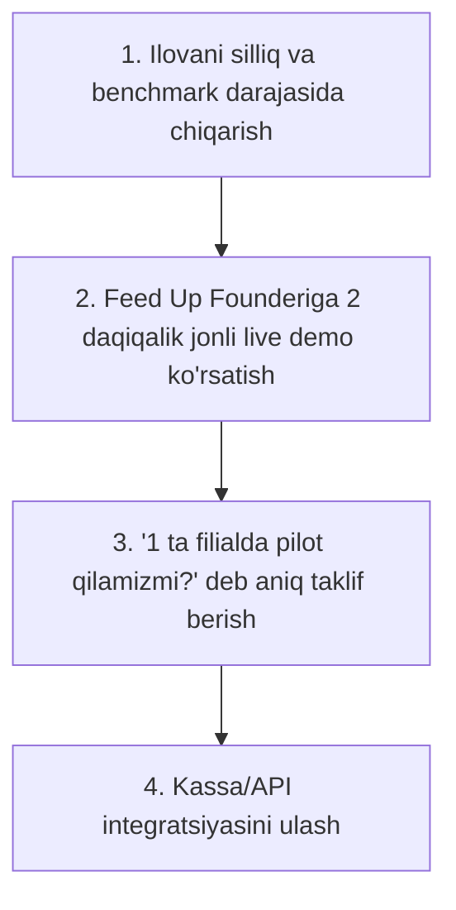

# Feed Up Asoschisi Bilan Birinchi Jonli Uchrashuv Natijasi va Biznes Validatsiyasi

> **Hujjat maqomi:** Tarixiy milestone (tamg‘a), birinchi yirik food provider asoschisi bilan real bozor muloqoti tahlili, strategik pozitsiyalash va savdo strategiyasi.
> **Sana:** 2026-09-14
> **Muallif:** Zayuno Founders

---

## 1. Uchrashuv Konteksti va Jonli Muloqot Tafsilotlari

- **Sana va vaqt:** 2026-09-14
- **Joy:** Do‘kondan qaytayotganda (tasodifiy, yuzma-yuz uchrashuv)
- **Davomiyligi:** 5–6 daqiqa
- **Ishtirokchilar:** Zayuno asoschisi va Feed Up asoschisi
- **Mavzu:** Zayuno taklifini birinchi marta jonli taqdim etish va Feed Up bilan hamkorlik imkoniyatini o‘rganish

### Jonli suhbatda aytilgan gaplar (Stenogramma):
Do‘kondan qaytish paytida Feed Up asoschisi bilan uchrashib qoldik va Zayuno haqida taklif berdik. Suhbat 5–6 daqiqa davom etdi.

Founderning birinchi reaksiyasi va asosiy e’tirozlari:
> **1. В«Nafika kerak menga?В»** *(Menga nima keragi bor?)*
> **2. «Yandex, Alisa mana shu yo‘lda ketyapti-ku, Yandex buni qilyapti. Ertaga ular chiqsa nima qilasan? Alisa hozir uyimda hammasini qilyapti, nafika kerak seniki?»**
> **3. «Agar AI noto‘g‘ri zakaz qilsa-chi?»** *(Javobgarlik, xavotir va risk masalasi).*

Va suhbat oxirida eng muhim hal qiluvchi gap:
> ### 🚀 **«Ilovangni chiqar, ishlashini ko‘raylik. Shunga qarab integratsiya qilishimiz mumkin.»**

---

## 2. Nega bu В«Rad JavobiВ» emas, balki Katta В«GO SignalВ»?

Bir qarashda «Nafika kerak?» so‘zi sovuq tuyulishi mumkin. Ammo founderning keyingi gaplari vaziyatni 180 darajaga o‘zgartiradi:
1. U seni **rad etmadi**.
2. U ikkita eng chuqur, eng amaliy va haqiqiy biznes savolini berdi:
   - **Raqobat va defensibility:** Yandex/Alisa qilsa, Zayunoning o‘rni qayerda?
   - **Xavf va javobgarlik:** Agar AI adashsa, yetkazib berish va hisob-kitobni kim to‘g‘rilaydi?
3. Va nihoyat, eng katta yakuniy signalni berdi: **«Ilovangni chiqar, ishlashini ko‘raylik. Shunga qarab integratsiya qilishimiz mumkin.»**

Bu — **aniq GO signal**. Bu — ochiq qolgan eshik. Bu shuni bildiradiki, Feed Up asoschisi marketing shiorlariga emas, **ishlayotgan real mahsulotga (working product)** qaraydigan tajribali tadbirkor.

---

## 3. Savol 1 Tahlili: В«Yandex/Alisa qilsa nima qilasan? Zayunoning keragi nima?В»

Bu savol Zayunoning bozordagi asl pozitsiyasini kristalldek tiniqlashtirib berdi:

### Asosiy xato tushuncha:
Biz o‘zimizni Yandex yoki Alisaning raqobatchisi bo‘lgan «yana bitta chatbot/agent» deb ko‘rsatmasligimiz kerak!

### Strategik javob va haqiqat:
> **«Alisa, ChatGPT, Gemini — bu foydalanuvchi tarafidagi agentlar (Consumer Agents).
> Zayuno esa — Feed Up kabi restoran va xizmatlarni ushbu agentlarga ulab beruvchi infratuzilma va ishonch qatlami (Provider Action Infrastructure + Distribution Layer)!»**

Ertaga Alisa, ChatGPT yoki Gemini O‘zbekistonda buyurtma qilishni xohlasa ham, ularda quyidagi savollar ochiq qoladi:
- Menyu qayerdan olinadi va kim yangilab turadi?
- Qaysi filialda qaysi mahsulot hozir bor (real-time stock)?
- Modifikatorlar, pishirish talablari qanday hisoblanadi?
- Yetkazib berish narxini (quote) kim aniq hisoblaydi?
- Buyurtma Feed Up kassa tizimiga (iiko/Jowi) qanday tushadi?
- To‘lov, status o‘zgarishi (tayyorlanmoqda, yetkazilmoqda) va bekor qilish (cancel) qanday ishlaydi?

**Mana shu provider-side integratsiya, ishonchlilik va kassa bog‘lanishi — bu aynan ZAYUNO.**
Zayuno — restoranlarni nafaqat o‘zining ilovasiga, balki ertaga Alisa, ChatGPT va boshqa har qanday AI agentga ochib beradigan ko‘prikdir.

---

## 4. Savol 2 Tahlili: «Agar AI noto‘g‘ri zakaz qilsa-chi?»

Bu har qanday restoran egasining eng haqli va mantiqiy xavotiri. Hech bir restoran egasi mijozga noto‘g‘ri taom ketishi yoki pulda adashishni xohlamaydi.

Aynan shu savolga javob sifatida Zayunoning **Ishonch va Tekshiruv Qatlami (Trust & Verification Layer)** ko‘rsatiladi:

1. **AI o‘zboshimchalik bilan zakaz qilmaydi:** AI faqat taklif qiladi va mijozning niyatini (intent) tushunadi.
2. **Foydalanuvchiga yakuniy savat (Cart) ko‘rsatiladi:** Har bir taom, miqdori va narxi ekranda yaqqol ko‘rinadi.
3. **Eksplitsit tasdiq (Confirmation):** Foydalanuvchi tugmani aniq bosib tasdiqlamasa, tizimdan buyurtma aslo ketmaydi.
4. **Haqiqat manbai (Source of Truth) — bu Restoranning o‘zi:** Narxlar, yetkazish to‘lovi va mavjudlik AI tomonidan to‘qib chiqarilmaydi, balki to‘g‘ridan-to‘g‘ri Feed Up API/kassasidan olinadi.
5. **Idempotency va audit:** Tarmoqdagi uzilishlar tufayli buyurtma hech qachon 2 marta takrorlanmaydi (idempotency key orqali bloklanadi). Har bir harakat log qilinadi.
6. **Bekor qilish va status oqimi:** Agar mijoz adashganini sezsa, bekor qilish va almashtirishning rasmiy oqimi mavjud.

### Zayuno Formulosi:
> **«AI tavsiya qiladi va xohishni tushunadi. Real order esa faqat restoran ma’lumotlari va foydalanuvchining shaxsiy tasdig‘i bilan yaratiladi.»**

---

## 5. Yangilangan Zayuno Ta’rifi (Positioning)

> ### **Zayuno — shunchaki agent emas.**
> ### **Zayuno — provider action infrastructure + distribution layer.**

Restoranlar uchun Zayuno:
- Yangi xarajat emas;
- Yangi yuk emas;
- Balki **В«Tayyor buyurtmalar oqimini olib keluvchi, xavfsiz va kafolatlangan savdo kanaliВ»**.

---

## 6. Keyingi Bosh Maqsad va Amaliy Harakat Rejasi

Founderning o‘zi eng to‘g‘ri yo‘lni ko‘rsatdi: **«Ilovangni chiqar, ishlashini ko‘raylik. Shunga qarab integratsiya qilishimiz mumkin.»**

Shundan kelib chiqib, yagona va eng aniq maqsad:

### Amaliy qadamlar:
1. **Mobil ilova va buyurtma oqimini ideal holatga keltirish:**
   - Hech qanday xatoliksiz, tabiiy o‘zbek tilida taom tanlash, savatni ko‘rsatish va buyurtma qilish.
2. **Feed Up asoschisiga 2 daqiqalik live demo:**
   - Ko‘chada yoki uchrashuvda telefonni chiqarib ko‘rsatish: *«Aka, aytganingizdek ilovani chiqardik. Mana, 30 soniyada buyurtma qanday yig‘ilayotganini ko‘ring. Hech qanday adashish yo‘q, oxirgi tasdiq mijozning o‘zida.»*
3. **Pilot loyiha:**
   - *«Keling, bitta filialingizda sinab ko‘raylik. Agar yoqsa, davom ettiramiz.»*

---

## 7. Muloqot Shabloni (Yangi Follow-up Xabari)

> **Assalomu alaykum aka!**
> Do‘kon oldidagi suhbat va savollaringiz uchun katta rahmat. Ayniqsa Yandex/Alisa va zakaz xavfsizligi bo‘yicha aytgan fikrlaringiz juda to‘g‘ri bo‘ldi.
>
> Siz aytgandek, biz ilovani chiqardik va silliq ishlaydigan holatga keltirdik.
>
> Biz Alisa bilan raqobatlashmaymiz — aksincha, Alisa yoki ChatGPT ertaga O‘zbekistonga kirsa ham, Feed Up menyusi, kassa tizimi va zakazlar to‘g‘ri tushishi uchun Zayuno o‘rtadagi ishonchli ko‘prik bo‘lib beradi. Eng muhimi, AI o‘zboshimchalik bilan buyurtma bermaydi — mijoz har bir narx va taomni o‘zi tasdiqlaydi.
>
> Ilova qanday ishlayotganini 2 daqiqada sizga ko‘rsatib bermoqchiman. Qachon 5 daqiqa vaqtingiz bo‘ladi?

---

## 8. Xulosa (Tarixiy Tamg‘a)

Ushbu 5–6 daqiqalik kutilmagan uchrashuv Zayunoning butun kelajagi uchun eng muhim burilish nuqtalaridan biri bo‘ldi. U loyihaga:
1. Asl raqobatbardoshlik pozitsiyasini topib berdi;
2. Ishonch va xavfsizlik (Trust Layer) qadrini ko‘rsatdi;
3. Va eng muhimi — O‘zbekistonning eng yirik fast-food tarmog‘iga integratsiya uchun ochiq eshik yaratdi.
