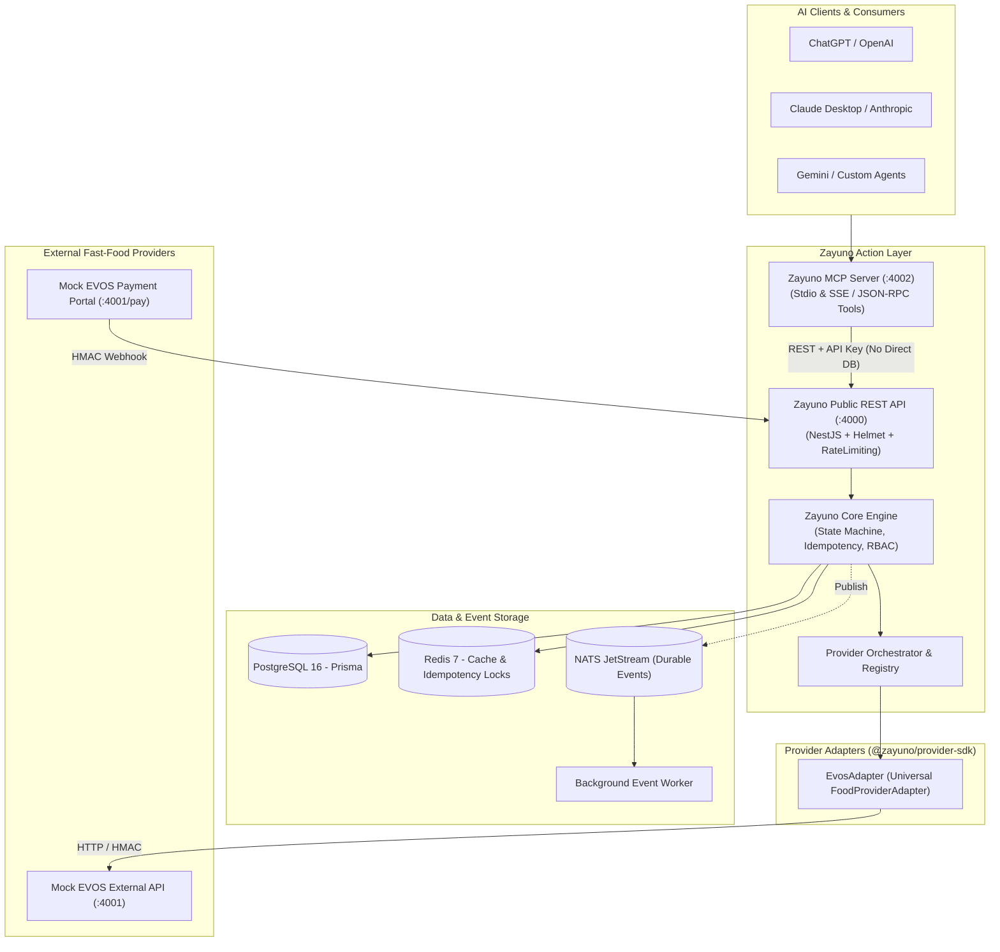

# Zayuno — Action Infrastructure for AI Agents

> **Action Layer & Execution Engine connecting ChatGPT, Claude, Gemini, and autonomous AI agents to real-world transactional fast-food providers (starting with EVOS).**

[](https://www.typescriptlang.org/)
[](https://turbo.build/)
[](https://nestjs.com/)
[](https://www.prisma.io/)
[](https://modelcontextprotocol.io/)

---

## 1. Overview & Vision

Zayuno serves as the **Universal Action Layer** between conversational AI Agents and real service providers. 

While the platform is architected for thousands of providers across domains (fast-food, taxi, hotels, delivery, shopping), the **MVP focus is fast-food ordering with EVOS as the primary showcase**.

Because EVOS production credentials are not yet available, the entire platform is pre-engineered with a standalone **Mock EVOS API & Interactive Payment Simulator (:4001)** and a typed **Pluggable Adapter System**.

> **Plug & Play**: When EVOS delivers production credentials, only the isolated provider adapter (`integrations/evos`) is connected without touching the core engine.

---

## 2. High-Level Architecture



---

## 3. End-to-End User Flow in ChatGPT / Claude

1. **User asks:** *"EVOS menusini ko‘rsat."*
   - `MCP -> get_menu` -> returns categorized EVOS menu (Lavash, Burgers, Sets, Drinks).
2. **User requests:** *"X Setdan 2 ta olaman. Chilonzor 9-mavze, 12-uyga yetkazib ber."*
   - `MCP -> quote_order` -> verifies availability, computes items breakdown:
     - 2 × X Set = 118,000 UZS
     - Delivery Fee = 15,000 UZS
     - **Total = 133,000 UZS**
   - AI shows the quote and asks for **explicit confirmation**.
3. **User confirms:** *"Ha, buyurtma qil."*
   - `MCP -> create_order` with `idempotency_key` -> Creates order in Zayuno and EVOS.
4. **Payment Options:**
   - `MCP -> get_payment_options` -> Returns Cash option and **Payme / Card Checkout URL**.
5. **Interactive Payment Simulation:**
   - User opens Checkout URL (`http://localhost:4001/mock/pay/:orderId`).
   - Clicks **[ PAY VIA PAYME (SUCCESS) ]**.
   - Mock EVOS sends HMAC-signed webhook `PAYMENT_COMPLETED` to Zayuno.
6. **Live State Updates:**
   - `AWAITING_PAYMENT` -> `PAID` -> `ACCEPTED` -> `PREPARING` -> `DELIVERING` -> `COMPLETED`.
   - Real-time visibility in **Admin Console** and **Provider Portal**.

---

## 4. Monorepo Structure

```text
zayuno/
├── apps/
│   ├── api/                     # NestJS Core API + Webhooks + Swagger (:4000)
│   ├── mcp/                     # Model Context Protocol stdio & SSE Server (:4002)
│   ├── worker/                  # NATS JetStream Event Worker
│   ├── admin/                   # React + Vite + Tailwind Admin Panel (:3000)
│   └── provider-portal/         # React + Vite + Tailwind Provider Portal (:3001)
├── packages/
│   ├── contracts/               # Normalized DTOs, Zod schemas, TypeScript Interfaces
│   ├── provider-sdk/            # @zayuno/provider-sdk (Abstract base adapter & test harness)
│   ├── database/                # Prisma ORM schema, migrations, seeders, client singleton
│   ├── event-schemas/           # NATS & Event payloads (order.*, payment.*, webhook.*)
│   ├── shared/                  # AES-256-GCM crypto, HMAC, errors, idempotency helpers
│   └── observability/           # OpenTelemetry trace IDs, latency metrics collector
├── integrations/
│   ├── mock-evos/               # Standalone Mock EVOS HTTP Service & Payment Portal (:4001)
│   └── evos-adapter/            # EvosAdapter implementing FoodProviderAdapter
├── infra/
│   ├── docker/                  # Dockerfiles for each service
│   └── nginx/                   # Nginx reverse proxy configs
├── tests/
│   ├── run-e2e.ts               # Complete automated 13-step E2E lifecycle test suite
│   └── unit/                    # Unit tests for cryptography, security, pricing
├── docker-compose.yml           # Unified Docker Compose
├── .env.example
└── README.md
```

---

## 5. Quick Start (Local Setup)

### Prerequisites
- Node.js >= 20.0
- pnpm >= 9.0 (`npm i -g pnpm`)
- Docker & Docker Compose

### 1. Clone & Configure
```bash
cp .env.example .env
```

### 2. Start PostgreSQL, Redis & NATS with Docker
```bash
docker compose up -d postgres redis nats
```

### 3. Install & Initialize Database
```bash
pnpm install
pnpm db:generate
pnpm db:push
pnpm db:seed
```

### 4. Start Core Services
```bash
# Terminal 1: Starts Mock EVOS (:4001), API (:4000), MCP (:4002), and Worker
pnpm dev:core

# Terminal 2: Starts Admin Panel (:3000) & Provider Portal (:3001)
pnpm dev:apps
```

---

## 6. Default Test Credentials

| Role / Service | URL / Key | Username / Secret | Password |
|:---|:---|:---|:---|
| **Super Admin** | `http://localhost:3000` | `admin@zayuno.io` | `admin12345` |
| **EVOS Provider Owner** | `http://localhost:3001` | `evos.owner@zayuno.io` | `evos12345` |
| **AI Agent API Key** | `x-api-key` header | `zy_live_agent_secret_key_12345` | — |
| **Public API / Swagger** | `http://localhost:4000/api/docs` | — | — |
| **Mock EVOS API** | `http://localhost:4001` | — | — |
| **Mock Payment Portal** | `http://localhost:4001/mock/pay/:orderId` | — | — |
| **MCP SSE Server** | `http://localhost:4002` | — | — |

---

## 7. Running the Automated E2E Test Suite

Execute the complete 13-step fast-food lifecycle test (Menu query -> Quote -> Confirm -> Idempotent order creation -> Payment URL -> Mock payment -> HMAC Webhook -> Status progression -> Final timeline audit):

```bash
npx ts-node tests/run-e2e.ts
```

---

## 8. MCP Server Configuration for Claude Desktop / ChatGPT

To use Zayuno with **Claude Desktop**, add the following to your `claude_desktop_config.json`:

```json
{
  "mcpServers": {
    "zayuno": {
      "command": "node",
      "args": ["<PATH_TO_ZAYUNO>/apps/mcp/dist/index.js"],
      "env": {
        "API_BASE_URL": "http://localhost:4000",
        "ZAYUNO_API_KEY": "zy_live_agent_secret_key_12345"
      }
    }
  }
}
```

---

## 9. Security & Idempotency Architecture

1. **Idempotency Guarantee**: Every `create_order` action requires an `idempotencyKey`. Repeated requests from AI agents return the previously created order immediately without duplicate charges or provider calls.
2. **Encrypted Credentials**: Partner provider secrets and keys are encrypted using **AES-256-GCM** with unique IV and authentication tags.
3. **Webhook HMAC Signatures**: Inbound webhooks are verified with constant-time HMAC-SHA256 signatures to prevent replay attacks and forgery.
4. **Zayuno Payment Boundary**: Zayuno **never** stores or processes credit card details. Payment is initiated via the provider's external payment gateway and confirmed through signed webhooks.

---

## 10. CI/CD & Production Deployment

Zayuno uses a zero-downtime GitHub Actions + GitHub Container Registry (GHCR) deployment pipeline:

- **CI Pipeline (`.github/workflows/ci.yml`)**: Runs on PR and push to `main` (linting, contract tests, security guardrails, and full monorepo build).
- **Image Pipeline (`.github/workflows/build-images.yml`)**: Builds immutable container images for changed services only and pushes to `ghcr.io/<owner>/<repo>/<service>:<sha>`.
- **Deploy Workflow (`.github/workflows/deploy-production.yml`)**: Dispatches on-demand releases to the production host (`158.220.100.58`) using strict SSH, one-off database migrations, targeted container recreation, and automatic rollback on health-check failure.

For complete documentation, secret setup, and rollback instructions, see [docs/deployment.md](docs/deployment.md).

