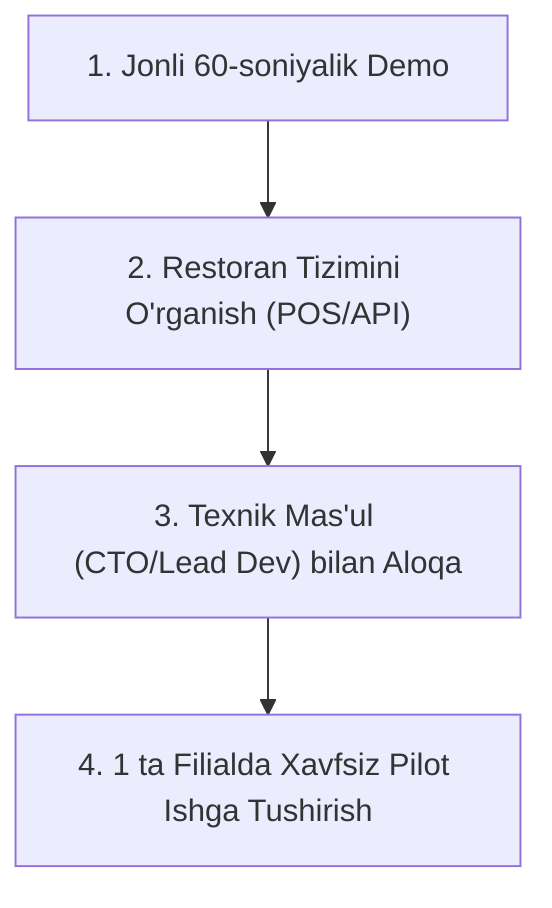

# Feed Up Asoschisi Bilan Birinchi Jonli Uchrashuv Natijasi va Biznes Validatsiyasi

> **Hujjat maqomi:** Tarixiy milestone (tamg‘a), birinchi yirik food provider bilan real bozor muloqoti tahlili va Zayuno savdo strategiyasini qayta shakllantirish bo‘yicha qo‘llanma.  
> **Sana:** 2026-09-14  
> **Muallif:** Zayuno Founders  

---

## 1. Uchrashuv Konteksti va Tarixi

- **Sana va vaqt:** 2026-09-14
- **Joy:** Do‘kondan qaytayotganda (tasodifiy, yuzma-yuz uchrashuv)
- **Davomiyligi:** 5–6 daqiqa
- **Ishtirokchilar:** Zayuno asoschisi va Feed Up asoschisi
- **Mavzu:** Zayuno taklifini birinchi marta jonli taqdim etish va Feed Up bilan hamkorlik imkoniyatini o‘rganish

### Jonli muloqot qanday kechdi?
Do‘kondan qaytish paytida Feed Up asoschisi bilan kutilmaganda uchrashib qoldik. Fursatdan foydalanib, Zayuno loyihasi haqida qisqacha ma’lumot berildi va platformaga ulanish taklifi bildirildi. Suhbat 5–6 daqiqa davom etdi.

Suhbat davomida Feed Up asoschisi tomonidan berilgan eng asosiy va keskin savol:
> ### **«Nafika kerak menga?»** *(Menga nima keragi bor?)*

---

## 2. «Nafika kerak menga?» e’tirozining tub tahlili

Ko‘pchilik yangi startaplar bunday so‘zni eshitganda buni **«rad javobi» (rejection)** deb o‘ylashi va tushkunlikka tushishi mumkin. Biroq bu mutlaqo unday emas. Bu — **haqiqiy oltin qiymatidagi bozor fikri (validation feedback)**.

### Nega bu rad javobi emas?
1. **Texnik rad emas:** U «tizimingiz yomon» yoki «bizga bu texnologiya to‘g‘ri kelmaydi» degani yo‘q.
2. **Eshitishga tayyor bo‘lgan:** 5–6 daqiqa ko‘chada to‘xtab gaplashgani — uning diqqati jalb qilinganini ko‘rsatadi.
3. **Value Proposition (Qiymat taklifi) yetib bormagan:** U Zayunoning aynan o‘z biznesiga keltiradigan **aniq foydasini** ko‘rmadi.

### Restoran asoschisining ichki dunyosi va psixologiyasi:
Yirik tarmoq asoschisi (Feed Up) har kuni quyidagilar bilan yashaydi:
- O‘nlab filiallar, yuzlab xodimlar, uzluksiz operatsiyalar;
- O‘zining mavjud mijozlar oqimi;
- O‘zining kassa/POS tizimi (iiko, Jowi yoki R-Keeper);
- O‘zining yetkazib berish xizmati, Telegram boti yoki ilovasi.

Agar unga: *«Bizda AI bor, ChatGPT orqali ishlaydi, MCP bor, integratsiya qilamiz»* deb gap boshlansa, tadbirkorning miyasida quyidagi fikrlar aylanadi:
> *«Yana bitta yangi dastur... Yana bitta boshog‘riq... Dasturchilarimga ortiqcha ish... Buning ustiga menda shundoq ham buyurtmalar bor. Menga bu narsaning nafika keragi bor?»*

Tadbirkorga texnologiya, sun’iy intellekt yoki zamonaviy arxitektura qiziq emas. Tadbirkor faqat ikkita narsaga qaraydi:
1. **Bu menga qo‘shimcha pul (revenue) va yangi mijoz olib keladimi?**
2. **Bu mening joriy ishimni osonlashtiradimi yoki qiyinlashtiradimi?**

---

## 3. Strategik Dars: Pitch Qayerda Xato Boshlandi?

| ❌ Eski / Xato Yondashuv | ✅ To‘g‘rilangan / Yangi Yondashuv |
| :--- | :--- |
| **Texnologiyani sotish:** «Bizda AI agent bor, aqlli tavsiya qiladi, MCP orqali ulanadi.» | **Biznes natijasini sotish:** «Sizga hech qanday xarajatsiz mutlaqo yangi buyurtma kanali ochib beramiz.» |
| **Integratsiya yukini eslatish:** «Tizimingizni bizga integratsiya qilib berishingiz kerak.» | **Yukni to‘liq zimmaga olish:** «Integratsiyani to‘liq o‘zimiz qilamiz. Sizdan yangi IT-mutaxassis yoki resurs talab etilmaydi.» |
| **Xususiyatlar (Features):** LLM, bot, chat, API. | **Foyda (Benefits):** Qo‘shimcha tushum, yangi auditoriya, avtomatlashgan savdo. |

---

## 4. To‘g‘rilangan Yangi Value Proposition Formulalari

Kelgusida Feed Up asoschisi bilan qayta bog‘lanishda yoki boshqa yirik restoranlar (Evos, MaxWay, Chopar, Bellissimo) bilan uchrashuvlarda quyidagi aniq formuladan foydalaniladi:

### 📢 Yangi Pitch:
> **«Aka, biz sizga mutlaqo yangi buyurtma kanali ochib beramiz. Foydalanuvchi ChatGPT, Telegram yoki Zayunoda ovqat qidirganda Feed Up taklif qilinadi va mijoz tanlagan taomlar to‘g‘ridan-to‘g‘ri sizning oshxonangiz/kassangizga tayyor buyurtma bo‘lib tushadi.**  
>  
> **Integratsiyani to‘liq o‘z zimmamizga olamiz. Sizga yangi dasturchi yollash yoki alohida xarajat qilish shart emas.»**

### 🎯 Eng muhim lakmus savoli (Validation Question):
Har qanday restoratorga beriladigan hal qiluvchi savol:
> **«Aka, agar biz sizga oyiga qo‘shimcha 500–1000 ta tayyor buyurtma olib kelsak, shunda sizga qiziq bo‘ladimi?»**

Bu savolga javob:
- Agar: *«Ha, albatta, qo‘shimcha buyurtma va yangi mijozlar har doim kerak»* desa — **mana shu haqiqiy yashil chiroq va biznes validatsiyasidir!**
- Agar: *«Yo‘q, menga umuman yangi buyurtma kerak emas, filiallarim to‘lib ketgan»* desa — demak u hozircha Zayunoning maqsadli mijozi emas.

---

## 5. Keyingi Qadamlar va Amaliy Reja (Action Plan)

Bu birinchi qimmatli uchrashuvni “qiziq ekan” darajasida to‘xtatib qo‘ymaslik uchun quyidagi 4 bosqichli amaliy qadamlar belgilanadi:

### 1-qadam: 60 soniyalik jonli ishlayotgan demo tayyorlash
Ko‘p gapirmasdan, amalda ko‘rsatish:
- Telefonni ochib: *«Men burger yemoqchiman»* deyiladi.
- Zayuno eng yaqin filial menyusidan tanlab, narxini ko‘rsatib, 1 bosishda buyurtma shakllantirganini ko‘rsatish.
- *«Mana, ko‘rdingizmi? Mijoz hech qayerga kirmasdan buyurtma berdi va bu sizning tizimingizga tushdi.»*

### 2-qadam: Feed Up’ning amaldagi IT infratuzilmasini aniqlash
- Feed Up buyurtmalarni qanday qabul qiladi? (iiko, Jowi, R-Keeper yoki o‘zlarining xususiy serveri).
- Agar iiko bo‘lsa — Zayunoning iiko connectorlari orqali ulash juda oson.

### 3-qadam: Texnik qaror qabul qiluvchi bilan bog‘lanish
Founder strategik rozilik berganidan keyin:
- *«Aka, texnik tomonini 15 daqiqada sizning IT yoki kassa tizimingizga qaraydigan mas’ul odamingiz bilan gaplashib, hal qilib olsak bo‘ladimi?»* deb so‘rash.

### 4-qadam: 1 ta filialda tajriba (Pilot)
- Butun tarmoqni birdaniga ulash shart emas.
- Bitta filialda sinov tariqasida ishga tushirish taklif qilinadi: *«Keling, bitta filialingizda 1 hafta sinab ko‘raylik. Agar qo‘shimcha foyda keltirsa, qolgan filiallarni ham ulaymiz.»*

---

## 6. Muloqot Shabloni (Follow-up Message)

Uchrashuvdan keyin Feed Up asoschisiga yuborish uchun tayyor professional xabar matni:

> **Assalomu alaykum aka!**  
> Bugun do‘kon oldidagi suhbat uchun rahmat. Zayuno haqida qisqacha aytgandim — biz Feed Up uchun yangi xarajat yoki boshog‘riq emas, balki **qo‘shimcha tayyor buyurtmalar olib keladigan yangi savdo kanali** ochib bermoqchimiz.
>
> Foydalanuvchi sun’iy intellektdan (ChatGPT, Telegram, Zayuno) ovqat qidirganda Feed Up chiqadi va buyurtma to‘g‘ridan-to‘g‘ri sizning kassa/ordering tizimingizga tushadi. Integratsiyani to‘liq o‘zimiz qilamiz.
>
> Agar ma’qul bo‘lsa, sizga 10 daqiqada qanday ishlashini jonli ko‘rsatib beraman va IT bo‘yicha mas’ul odamingiz bilan bitta filialingizda sinov tariqasida (pilot) boshlab ko‘rishimiz mumkin.  
> Qachon sizga qulay bo‘ladi?

---

## 7. Zayuno Savdo Strategiyasi Uchun Oltin Qoidalar (Tamg‘a)

1. **Restoranga hech qachon AI sotma — restoranga BUYURTMA sot.**
2. **«Nafika kerak?» savolining birdan-bir to‘g‘ri javobi:** *«Sizga yangi mijoz va qo‘shimcha tushum olib kelish uchun!»*
3. **Integratsiya restoran uchun nol daqiqalik yuk bo‘lishi shart.** Agar restoran o‘z dasturchisini 1 hafta band qilishi kerak bo‘lsa, u rad etadi. Agar *«Hamma ishni o‘zimiz qilamiz»* deyilsa, eshik ochiladi.
