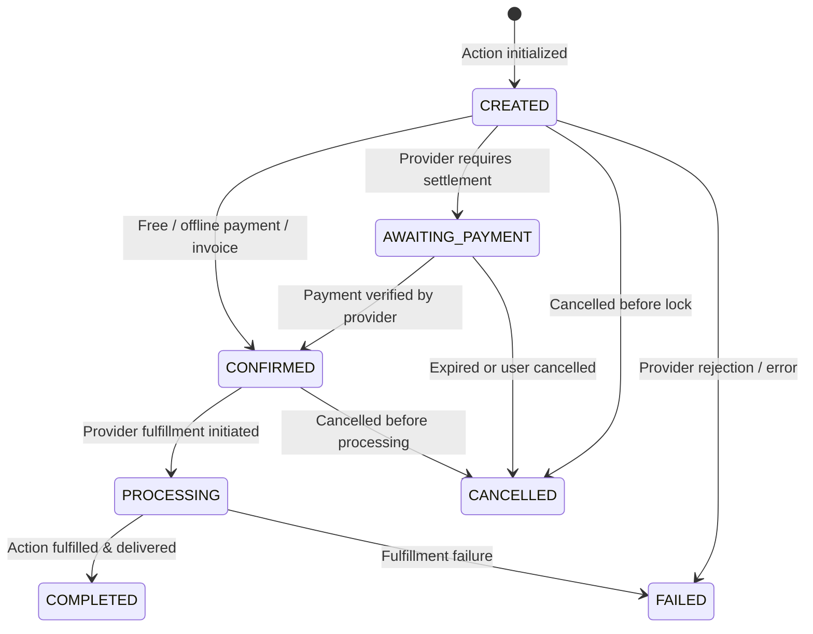

# Actions & Execution Lifecycle

An **Action** represents a confirmed real-world transaction dispatched from an AI agent to an external provider.

---

## 1. Action Status Lifecycle

All provider-specific order and execution statuses must be mapped into Zayuno's normalized lifecycle:



### Normalized Status Definitions:
- **`CREATED`**: Action received and recorded by Zayuno and provider.
- **`AWAITING_PAYMENT`**: Action requires customer payment via provider checkout URL before processing starts.
- **`CONFIRMED`**: Payment verified or order confirmed by merchant.
- **`PROCESSING`**: Provider backend is actively fulfilling or preparing the order.
- **`COMPLETED`**: Fulfillment finished, service rendered, or delivery delivered.
- **`CANCELLED`**: Cancelled by user or provider before completion.
- **`FAILED`**: Action failed due to validation, rejection, or external errors.

---

## 2. Action Creation Request

Provider dashboards display `paymentStatus` separately from the action status.
A `PAID` value is labelled `PROVIDER_REPORTED`: it represents the provider
integration's signed status update and is not a claim of bank settlement unless
the provider explicitly exposes settlement data. Cancellation and failure
events should include a clear, safe reason. See
[Provider Operations Dashboard and Moderation](./provider-operations.md).

Cancellation requests accept a stable `reasonCode` plus a clear `reason`:

```json
{
  "reasonCode": "CUSTOMER_CANCELLED",
  "reason": "Customer changed the travel date"
}
```

### Endpoint
`POST /api/v1/actions`

```json
{
  "idempotencyKey": "d8e379b2-6c9a-4e9b-83bb-92736152a1b9",
  "providerSlug": "acme-logistics",
  "quoteId": "quote_894103859",
  "userConfirmed": true,
  "customer": {
    "name": "Jane Doe",
    "phone": "+998901234567",
    "email": "jane@example.com"
  },
  "destination": {
    "raw": "Amir Timur Avenue 15, Tashkent"
  },
  "items": [
    {
      "offeringId": "offering_parcel_doc",
      "quantity": 1,
      "selectedOptions": [
        { "groupId": "grp_urgency", "optionId": "opt_rush", "quantity": 1 }
      ]
    }
  ]
}
```

### Action Creation Response
```json
{
  "id": "act_8849102",
  "publicId": "ZY-LOGISTICS-10928",
  "providerSlug": "acme-logistics",
  "externalActionId": "acme_order_9981",
  "status": "AWAITING_PAYMENT",
  "nextAction": {
    "type": "OPEN_URL",
    "url": "https://acme-logistics.example/pay/9981",
    "label": "Pay now",
    "expiresAt": "2026-08-17T16:15:00Z"
  },
  "total": 50000,
  "currency": "UZS",
  "createdAt": "2026-08-17T15:30:00Z"
}
```
