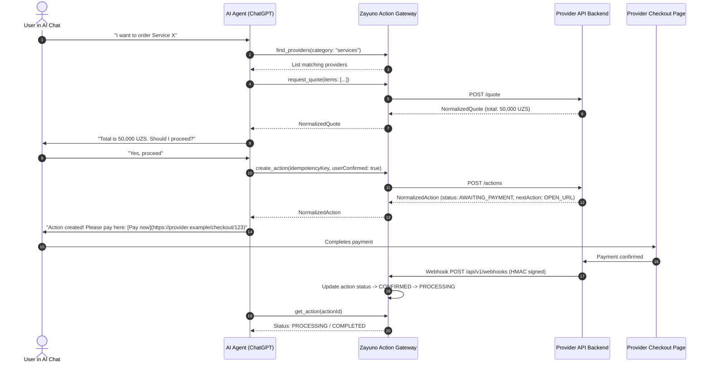

# Getting Started with Zayuno Provider Integration

Welcome to the **Zayuno Developer Platform**. Zayuno is an open, capability-based action infrastructure that connects AI agents (such as ChatGPT, Claude, and custom agentic systems) to real-world business services.

---

## 1. What is Zayuno?

Zayuno acts as a neutral communication and orchestration layer between AI agents and service providers. 

When a user in a conversational AI chat says:
> *"Book a courier to deliver documents across town"* or *"Order a family combo meal"*

The AI agent interacts with Zayuno's Model Context Protocol (MCP) gateway to:
1. **Discover** registered providers meeting the user's category, location, and requirements.
2. **Explore** catalogs, offerings, variants, and real-time availability.
3. **Calculate verified quotes** with itemized fees, taxes, and discounts.
4. **Obtain explicit user confirmation** before taking any action.
5. **Execute actions** against the provider's API with strict idempotency.
6. **Handoff payment** using provider-owned checkout links (`NextAction`).
7. **Track fulfillment** and delivery progress in real time via webhooks.

---

## 2. How Does Provider Integration Work?

Zayuno **never** hardcodes merchant logic into its core codebase. Instead, your engineering team implements the public **Zayuno Provider Contract v1**.

---

## 3. The 5-Minute Quick Start

### Step 1: Create a Developer Account
Visit [developers.zayuno.uz](https://developers.zayuno.uz/apps) and register your provider application.

### Step 2: Obtain Sandbox Credentials
Once registered, you receive:
- `providerSlug`: Your unique identifier (e.g. `acme-logistics`).
- `sandboxApiKey`: API key for testing authentication against the Zayuno sandbox.
- `sandboxWebhookSecret`: Secret used to sign and verify HMAC-SHA256 webhook payloads.

### Step 3: Implement Mandatory Capabilities
Your backend must expose endpoints conforming to the **Provider Contract v1**:
- **Health Check**: `GET /health`
- **Metadata**: `GET /provider-info`
- **Catalog**: `GET /catalog` and `GET /offerings/:id`
- **Quote Calculation**: `POST /quote`
- **Action Execution**: `POST /actions`
- **Action Status**: `GET /actions/:id`
- **Webhook Ingestion / Emission**: HMAC-SHA256 signature verification

### Step 4: Run Automated Certification
Navigate to the [Certification Runner](https://developers.zayuno.uz/certification) and execute the automated compliance suite. The runner checks metadata, quote mathematics, idempotency, payment handoffs, and webhook validation.

### Step 5: Submit for Production Review
When all mandatory capability tests pass with 100% success, submit your application. Platform operations will review and enable live AI agent discovery!
