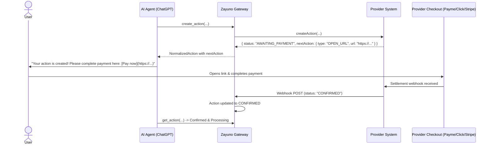

# Payment Handoff & NextAction Architecture

Zayuno strictly enforces a **zero payment processing** architectural boundary.

---

## 1. The Core Payment Rule

> [!IMPORTANT]
> **Zayuno NEVER processes payments or collects card details.**
> - Providers manage their own acquiring partnerships (e.g. Payme, Click, Uzum, Stripe, Adyen, POS terminals).
> - Providers own their checkout screens, fraud prevention, receipts, and fiscal registrations.
> - When an action requires payment, the provider returns an `AWAITING_PAYMENT` status with a normalized `NextAction` object.

---

## 2. Normalized `NextAction` Specification

```typescript
export interface NextAction {
  type: 'OPEN_URL' | 'REDIRECT' | 'CONFIRMATION_REQUIRED' | 'NONE';
  url: string;           // Provider-managed HTTPS checkout URL
  label: string;         // Button label presented to user (e.g. "Pay with Payme", "Checkout")
  expiresAt?: string;    // ISO timestamp when payment session expires
}
```

---

## 3. The End-to-End Handoff Flow


