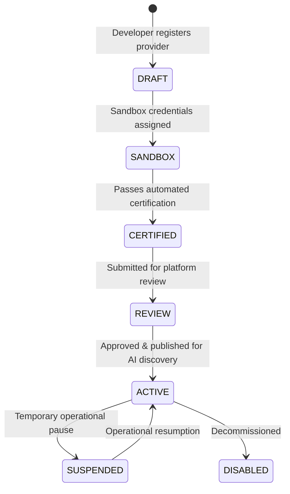

# Zayuno Provider Integration Specification v1

This document outlines the architectural contract for integrating third-party provider backends with the Zayuno AI Action Infrastructure.

---

## 1. Architectural Boundaries

1. **Protocol Neutrality**:
   - Zayuno Core is completely decoupled from any single provider, domain, or merchant category.
   - Core runtime operates solely with normalized data contracts defined in `@zayuno/contracts`.

2. **Strict Payment Boundary**:
   > [!IMPORTANT]
   > **ZAYUNO DOES NOT PROCESS PAYMENTS.**
   > - Zayuno does not collect customer funds.
   > - Zayuno does not store credit/debit card details.
   > - Zayuno does not integrate directly with payment aggregators (Payme, Click, Stripe, Uzum).
   > - Providers own their checkout pages, invoicing, and acquiring systems.
   > - If an action requires settlement, the provider returns an `AWAITING_PAYMENT` status containing a normalized `nextAction` of type `OPEN_URL`.

3. **Guaranteed Idempotency**:
   - Every mutating request (`POST /actions`) requires a client-generated `idempotencyKey`.
   - Providers must ensure duplicate submissions with identical idempotency keys return the original action record without duplicating internal state or double-charging.

---

## 2. Integration Modes

Providers can integrate with Zayuno via two models:

1. **Remote HTTP Endpoint (Standard)**:
   - The provider hosts an HTTPS API implementing the endpoints described in this specification.
   - Zayuno forwards agent requests directly over HTTPS with API Key or HMAC signatures.

2. **TypeScript / Node.js Adapter (SDK)**:
   - For high-performance or private enterprise deployments, providers implement the `ProviderAdapter` interface from `@zayuno/provider-sdk`.

---

## 3. Provider Lifecycle States

- **DRAFT**: Initial creation; configuring endpoints, capabilities, and auth.
- **SANDBOX**: Active in sandbox environment for developer testing and mock simulations.
- **ACTIVE**: Certified, approved, and discoverable by conversational AI agents.
- **SUSPENDED**: Temporarily hidden from agent discovery (e.g. backend maintenance).
- **DISABLED**: Deactivated.
