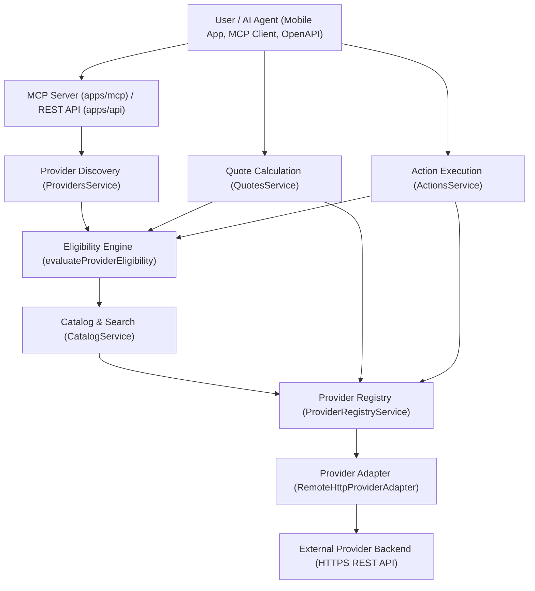
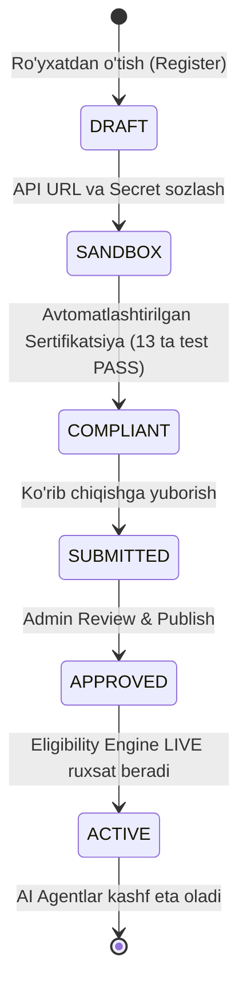

# Zayuno Platformasi Arxitektura Holati va Universallik Auditi
**Hujjat turi:** Tizimli Arxitektura Auditi va Texnik Xulosa (System Architecture Audit & Technical Report)
**Sana:** 2026-yil 20-sentabr
**Fayl yo'li:** `docs/zayuno-universality-architecture-audit.md`
**Holat:** Tayyorlandi (Hech qanday kod o‘zgartirilmadi, refactor qilinmadi, faqat mavjud codebase auditi)

---

## MUNDARIJA

1. [High-Level Architecture (End-to-End Tizim Oqimi)](#1-high-level-architecture)
2. [Canonical Data Model (Kanonik Ma'lumotlar Modeli)](#2-canonical-data-model)
3. [Provider #1001 Test — Code Review](#3-provider-1001-test--code-review)
4. [Provider-Specific / Domain-Specific Logic Audit](#4-provider-specific--domain-specific-logic-audit)
5. [Capability System (Qobiliyatlar Tizimi)](#5-capability-system)
6. [Catalog / Search Response Shape (Katalog va Qidiruv Hajmi)](#6-catalog--search-response-shape)
7. [Dynamic Projection Layer Possibility (Dinamik Proyeksiya Qatlami Imkoniyati)](#7-dynamic-projection-layer-possibility)
8. [Action / Quote Universality (Buyurtma va Narxlash Universalligi)](#8-action--quote-universality)
9. [Orchestration / AI Assistant Layer (Orkestratsiya va AI Yordamchi)](#9-orchestration--ai-assistant-layer)
10. [Provider Onboarding (Hamkorlarni Ulash Jarayoni)](#10-provider-onboarding)
11. [Hard-Coded Assumptions (Qattiq Kodlangan Taxminlar)](#11-hard-coded-assumptions)
12. [Core vs Adapter Boundary (Yadro va Adapter Chegaralari)](#12-core-vs-adapter-boundary)
13. [Universality Scorecard (Universallik Baholash Kartasi)](#13-universality-scorecard)
14. [Top Architecture Risks (Eng Yuqori Arxitektura Xatarlari)](#14-top-architecture-risks)
15. [What is Already Good (Allaqachon Yaxshi Ishlangan Qismlar)](#15-what-is-already-good)
16. [Final Verdict (Yakuniy Hukm)](#16-final-verdict)

---

## 1. HIGH-LEVEL ARCHITECTURE

Zayuno hozirgi vaqtda tashqi AI agentlar (ChatGPT, Claude, Custom Agentlar) va foydalanuvchilar (Mobile ilova / Chat) uchun tashqi provayderlarning raqamli va jismoniy xizmatlarini yagona kanonik qatlam orqali kashf etish, narxlash va ijro etish imkonini beruvchi platforma hisoblanadi.

### End-to-End Ishlash Oqimi:


### Layerlar Tahlili:

| Layer | Asosiy Fayllar | Asosiy Mas'uliyat (Responsibility) | Input / Output Contract | Turi |
| :--- | :--- | :--- | :--- | :--- |
| **MCP Layer** | `apps/mcp/src/tools.ts`, `apps/mcp/src/server.ts` | 15 ta standart MCP toolni modelga taqdim etish, JSON schema validatsiyasi, xavfsizlik filtrlari | Input: Tool Arguments (JSON). Output: Pre-formatted `customerMessage` + canonical object | Generic |
| **REST API Layer** | `apps/api/src/modules/*/*.controller.ts` | HTTP marshrutlash, Auth guardlar (ApiKeyGuard, JwtAuthGuard), Swagger hujjatlash | DTOs (Zod/Class-validator) -> HTTP JSON response | Generic |
| **Provider Discovery** | `apps/api/src/modules/providers/providers.service.ts` | Hamkorlarni kategoriya, subkategoriya, geolokatsiya, kalit so'z va muhit bo'yicha qidirish | `FindProvidersInput` -> `FindProvidersResult` (`PublicProviderInfo[]`) | Generic |
| **Eligibility Engine** | `packages/shared/src/provider-eligibility.ts` | LIVE/ACTIVE, salomatlik, sertifikatsiya va ruxsat etilgan capabilitylarni tekshirish | `Provider` obyekti -> `ProviderEligibilityResult` (allowedCapabilities, visibility) | Generic |
| **Catalog & Search** | `apps/api/src/modules/catalog/catalog.service.ts` | Ierarxik katalog, saralash, dinamik parametrlar validatsiyasi, 2 darajali Redis kesh | `GetCatalogInput`, `SearchCatalogInput` -> `Catalog`, `Offering[]` | Generic |
| **Quote Service** | `apps/api/src/modules/quotes/quotes.service.ts` | Majburiy xarid qiymatini provayder orqali hisoblash, muddat (TTL) bilan DBga saqlash | `RequestQuoteInput` -> `NormalizedQuote` | Generic |
| **Action Service** | `apps/api/src/modules/actions/actions.service.ts` | Idempotentlik, `dbQuote` moliyaviy yaxlitlik nazorati, DB Action va ActionEvent yozish | `CreateActionInput` -> `NormalizedAction` (`PublicAction`) | Generic |
| **Payment & Webhook** | `apps/api/src/modules/webhooks/webhooks.service.ts` | HMAC-SHA256 tekshiruvi, webhook deduplikatsiyasi, holatlar tranzitsiyasi | Raw HTTP Request -> `WebhookProcessingResult` | Generic |
| **Adapter Registry** | `apps/api/src/modules/providers/provider-registry.service.ts` | Shifrlangan kalitlarni ochish, adapter instansiyalarini keshga olish va yuklash | `providerSlug` -> `ProviderAdapter` instansiyasi | Generic (Sandbox mocklarida istisno bor) |
| **Provider Adapter** | `packages/provider-sdk/src/remote-http-adapter.ts` | Tashqi provayderning HTTP API'sini chaqirish va kanonik shaklga keltirish | Kanonik parametrlar -> Tashqi HTTP -> Kanonik DTO | Generic |
| **Consumer Chat** | `apps/api/src/modules/consumer/chat/consumer-chat.service.ts` | Gemini 3.5 orqali foydalanuvchi bilan tabiiy muloqot, slot-filling, buyurtma yig'ish | Chat xabarlari -> AI javobi + ChatInteraction | **Domain-Specific (Leak)** |

---

## 2. CANONICAL DATA MODEL

Kanonik ma'lumotlar modeli yagona manba sifatida `packages/contracts/src/` paketida Zod yordamida e'lon qilingan va `packages/database/prisma/schema.prisma` da relyatsion bazaga xaritalangan.

### Modellar Ro'yxati va Kontrakt Tahlili:

#### 1. Provider
- **Source file:** `packages/contracts/src/provider.ts` (`ProviderInfoSchema`, `PublicProviderInfoSchema`), `packages/database/prisma/schema.prisma` (model `Provider`).
- **Asosiy maydonlar:** `slug`, `name`, `status` (`DRAFT|SANDBOX|ACTIVE|SUSPENDED|DISABLED`), `type` (`RETAIL|DELIVERY|SERVICES|BOOKINGS|TICKETING|DIGITAL|COMMERCE|OTHER`), `environment` (`LIVE|SANDBOX|STAGING`), `category` (`ProviderCategory` enum), `subcategory`, `fulfillmentMode` (`ONSITE|DELIVERY|PICKUP|REMOTE|HYBRID`), `capabilities` (`ProviderCapability[]`), `baseUrl`, `supportContact`.
- **Universal maydonlar:** `slug`, `name`, `status`, `environment`, `capabilities`, `baseUrl`, `supportContact`.
- **Domain-specific xavfi:** `type` va `category` enumlari. `ProviderCategory` 13 ta vertikalni o'z ichiga oladi (`FOOD_AND_DRINK`, `TICKETING`, `ACCOMMODATION`, `RECRUITMENT`, va h.k.).
- **Metadata ishlatilishi:** Shartnoma versiyasi, eligibility siyosati (`metadata.eligibility`), salomatlik monitoringi (`metadata.healthMonitoring`), sertifikat dalillari.

#### 2. Location
- **Source file:** `packages/contracts/src/location.ts` (`LocationSchema`), `packages/database/prisma/schema.prisma` (model `Location`).
- **Asosiy maydonlar:** `id`, `providerId`, `providerLocationId`, `name`, `address`, `coordinates` (`latitude`, `longitude`), `operatingHours`, `serviceRadiusKm`, `isActive`.
- **Universal maydonlar:** `id`, `name`, `address`, `isActive`.
- **Domain-specific xavfi:** `serviceRadiusKm` (aniq yetkazib berish/food taxmini). Online/virtual xizmatlarda filial bo'lmasligi mumkin (buni `fulfillmentMode: REMOTE` orqali muvozanatlashtirilgan).

#### 3. Catalog & Offering
- **Source file:** `packages/contracts/src/catalog.ts` (`CatalogSchema`, `OfferingSchema`).
- **Asosiy maydonlar:** `id`, `providerId`, `offeringCode`, `title`, `description`, `categorySlug`, `imageUrl`, `media`, `basePrice`, `currency`, `isAvailable`, `variants` (`OfferingVariant[]`), `optionGroups` (`OptionGroup[]`), `tags`, `parametersSchema`.
- **Universal maydonlar:** `id`, `offeringCode`, `title`, `description`, `basePrice`, `currency`, `isAvailable`, `parametersSchema`.
- **Domain-specific xavfi:** Modifikatorlar (`optionGroups`, `options`, `priceDelta`) asosan ovqatlanish va kiyim-kechak chakana savdosiga moslashgan. Chipta, tibbiy ko'rik yoki yuk logistikasida "optionGroup" sun'iy tuyuladi.
- **Dinamik moslashuv:** `parametersSchema` (`DynamicParameterDeclarationSchema`) orqali xizmatlar erkin JSON Schema parametrlarini (masalan, sana, yo'nalish, yo'lovchilar soni) e'lon qilishi mumkin.

#### 4. Variant & OptionGroup
- **Source file:** `packages/contracts/src/catalog.ts` (`OfferingVariantSchema`, `OptionGroupSchema`, `OptionItemSchema`).
- **Asosiy maydonlar:**
  - Variant: `id`, `name`, `sku`, `basePrice`, `isAvailable`.
  - OptionGroup: `id`, `name`, `minSelections`, `maxSelections`, `isRequired`, `options: OptionItem[]`.
- **Universal maydonlar:** `id`, `name`, `basePrice`.
- **Semantika:** `SELECTED_OPTION_QUANTITY_SEMANTICS = 'PER_ITEM: option charge = priceDelta * selectedOption.quantity * item.quantity'` sifatida qat'iy belgilangan. Bu qoida oziq-ovqat va chakana savdo uchun mukammal, lekin chiptalar yoki xonani bron qilish uchun noqulay.

#### 5. Quote
- **Source file:** `packages/contracts/src/quote.ts` (`RequestQuoteInputSchema`, `NormalizedQuoteSchema`), `packages/database/prisma/schema.prisma` (model `Quote`).
- **Asosiy maydonlar:** `id`, `providerSlug`, `locationId`, `items` (`QuoteItemInput[]`), `lines` (`QuoteLine[]`), `subtotal`, `fees` (`QuoteFee[]`), `totalFees`, `discounts`, `totalDiscount`, `total`, `currency`, `expiresAt`, `parameters`, `destination`, `fulfillmentType`.
- **Universal maydonlar:** `id`, `subtotal`, `fees`, `discount`, `total`, `currency`, `expiresAt`, `parameters`.
- **Domain-specific xavfi:** `items: z.array(...).min(1)` talabi. Har bir so'rovda kamida bitta `offeringId` va soni bo'lishi shart. B2B xizmat yoki bepul maslahat uchun bu cheklov sun'iy.

#### 6. Action
- **Source file:** `packages/contracts/src/action.ts` (`CreateActionInputSchema`, `NormalizedActionSchema`, `PublicActionSchema`), `packages/database/prisma/schema.prisma` (model `Action`).
- **Asosiy maydonlar:** `id`, `publicId`, `providerSlug`, `quoteId`, `status`, `lines`, `subtotal`, `fees`, `discount`, `total`, `currency`, `customer` (`name`, `phone`, `email`), `destination`, `fulfillmentType`, `paymentMethod`, `paymentStatus`, `nextAction` (`type`, `url`, `label`), `idempotencyKey`.
- **Universal maydonlar:** `id`, `publicId`, `providerSlug`, `quoteId`, `status`, `total`, `currency`, `nextAction`, `idempotencyKey`.
- **Domain-specific xavfi:** Prisma bazasida `customerName String` va `customerPhone String` majburiy (NOT NULL). Telefon talab qilmaydigan online obuna yoki arizalar uchun Core dummy `'+998900000000'` yozishga majbur.

#### 7. PaymentOption
- **Source file:** `packages/contracts/src/payment.ts` (`PaymentOptionSchema`, `PublicPaymentOptionSchema`).
- **Asosiy maydonlar:** `id`, `name`, `type` (`PaymentMethodType`), `isOnline`, `checkoutUrl`, `qrCodeUrl`, `supportedCurrencies`.
- **Universalmi?** Ha. Zayuno hech qachon to'lovni o'zi yechmaydi, barcha to'lov provayderning xavfsiz sahifasi (`checkoutUrl`) orqali amalga oshadi.

#### 8. Webhook / Event
- **Source file:** `packages/contracts/src/webhook.ts` (`NormalizedWebhookEventSchema`).
- **Asosiy maydonlar:** `eventId`, `eventType`, `providerSlug`, `actionId`, `externalActionId`, `newStatus`, `newPaymentStatus`, `timestamp`, `payload`.
- **Universalmi?** Ha. Provider holat o'zgarishini HMAC-SHA256 bilan Zayunoga bildiradi.

#### 9. Errors
- **Source file:** `packages/shared/src/errors.ts` (`ZAYUNO_ERROR_CODES`).
- **Asosiy maydonlar:** 27 ta universal kod (`PROVIDER_NOT_FOUND`, `CAPABILITY_NOT_SUPPORTED`, `RESOURCE_UNAVAILABLE`, `CAPACITY_EXCEEDED`, `QUOTE_MISMATCH`, `QUOTE_EXPIRED`, `IDEMPOTENCY_CONFLICT`, va h.k.).
- **Universalmi?** Ha. Upstream xatolar (400-504) bitta taksonomiyaga keltiriladi.

### Core Domainlarni Biladimi?
**Xulosa:** Core shartnomalar darajasida (`@zayuno/contracts`, `@zayuno/database`) tizim asosan **"Katalog taklif qiluvchi va narxlovchi tranzaksion platforma"** sifatida qurilgan. Unda "food" yoki "ticket" deb maxsus jadval ochilmagan, ammo taksonomiya enumlarida (`ProviderCategory`) `FOOD_AND_DRINK`, `TICKETING`, `ACCOMMODATION`, `RECRUITMENT` kabi qiymatlar oldindan e'lon qilingan.

---

## 3. PROVIDER #1001 TEST — CODE REVIEW

Agar biz bugun mutlaqo yangi vertikal bo'yicha provayder qo'shsak (masalan, **Hotel Booking**, **Doctor Appointment**, **Logistics**, **Insurance**, **Car Rental**), kod bazasida qaysi fayllar o'zgarishi kerak?

### Yangi Domen Qo'shish Ssenariysi:

#### Ssenariy A: Provayder Zayuno Provider Protocol v1 ga to'liq mos kelsa (Standard Remote HTTP Adapter orqali):
Agar yangi provayder Zayuno'ning `/health`, `/catalog`, `/quote`, `/actions` spetsifikatsiyasini o'z tomonida realizatsiya qilsa:
1. **Core kodlarida birorta ham o'zgarish talab qilinmaydi!**
2. Provayder Portal (`apps/provider-portal`) orqali ro'yxatdan o'tadi (`POST /api/v1/providers/register`).
3. O'zining HTTPS URL va API Key'ini kiritadi.
4. Avtomatlashtirilgan sertifikatsiya testini topshiradi (`POST /api/v1/providers/:slug/certify`).
5. Admin tasdiqlaydi (`POST /api/v1/providers/:slug/publish`).
6. Provayder darhol AI kashfiyotiga (MCP tools) tushadi.

Bu xususiyat `tests/test-v4-scale-and-resilience.ts` faylidagi **Section V.2 ("Dynamic Provider #1001 Onboarding Invariant Proof")** orqali isbotlangan (1001-provayder yadroda 0 qator kod o'zgartirmasdan tizimga qo'shildi).

#### Ssenariy B: Domen yangi kategoriya yoki noan'anaviy semantikani talab qilsa:
Agar yangi domen mavjud enumlar doirasidan chiqsa (masalan, **Insurance** yoki **Car Rental** birinchi darajali kategoriya sifatida kerak bo'lsa):

| Fayl | Sabab | Universallikka Risk |
| :--- | :--- | :--- |
| `packages/contracts/src/provider.ts` | `ProviderCategory` enumiga yangi toifa (masalan `INSURANCE = 'INSURANCE'`) va uning aliaslarini qo'shish | **O'RTA**. Enum kengayishi, backward-compatible. |
| `packages/database/prisma/schema.prisma` | PostgreSQL enum ustuniga yangi qiymat qo'shish | **YUQORI**. Yangi Prisma migratsiyasi talab qilinadi. |
| `apps/api/src/modules/consumer/chat/consumer-chat.service.ts` | Agar bu domen Mobile ilovadagi chat yordamchisida maxsus tushuntirilishi kerak bo'lsa | **JUDA YUQORI (P1)**. Chat servisi universal intent bilan emas, balki if/else branching orqali ishlaydi. |
| `apps/mobile/src/components/...` | Agar mobil ilovada bu domenga oid alohida UI kartochkalari kerak bo'lsa | **YUQORI (P1)**. Mobil ilovada umumiy widget o'rniga domain widgetlar bor. |

#### Xulosa:
Core API va MCP qatlami — **Ideal (Adapter/Config/Certification only)**.
Lekin Consumer Chat va Mobil Ilova — **Domain-Hardcoded Trap**.

---

## 4. PROVIDER-SPECIFIC / DOMAIN-SPECIFIC LOGIC AUDIT

Codebase bo'yicha to'liq sintaktik tahlil o'tkazildi (jami **281 ta moslik** topildi).

### Tasniflash Mezonlari:
- **A) OK** — Tashqi provayder adapteri yoki integratsiya papkasi ichida (`integrations/*`, `scripts/`).
- **B) WARNING** — Core/Shared ichida, lekin xavfsizlik, test muhiti yoki brend himoyasi uchun zarur.
- **C) P0/P1 ARCHITECTURE LEAK** — Core yoki AI qatlamida platforma universalligini buzuvchi domain/provider-specific branching.

---

### TOP ARCHITECTURE LEAKS & FINDINGS:

#### 1. [LEAK - P0] Consumer Chat Service ichida Qattiq Kodlangan Ish va Vakansiya (Recruitment) Branching
- **File:** `apps/api/src/modules/consumer/chat/consumer-chat.service.ts`
- **Line:** L225–226, L4245–4262, L4729–4750
- **Snippet:**
  ```typescript
  // L4245: Kanonik bo'lmagan maydonlarni description regex orqali qirqib olish
  employer: item.metadata?.employerName ||
            item.description?.match(/Kompaniya:\s*([^\n]+)/)?.[1] ||
            provider.name,
  salary: item.metadata?.rawSalary
            ? this.formatSalary(item.metadata.rawSalary)
            : item.basePrice > 0 ? `${item.basePrice} ${item.currency}` : "Kelishilgan maosh",
  location: item.description?.match(/Hudud:\s*([^\n]+)/)?.[1] || "O'zbekiston",
  applicationLink: item.metadata?.alternateUrl ||
                   item.description?.match(/https:\/\/[^\s]+/)?.[0] || "",

  // L4735: Maxsus chat renderi
  if (plan.intent === "recruitment_search") {
    // Ariza topshirish tugmasi va vakansiya ro'yxatini alohida chiqarish
  }
  ```
- **Sabab:** Universal katalog modeli vakansiya ma'lumotlarini (ish beruvchi, maosh, havola) qanoatlantirmagani uchun chat servisi `item.description` dan regex bilan matn titkilashga va maxsus `recruitment_search` shoxlanishiga majbur bo'lgan.

#### 2. [LEAK - P1] Consumer Chat Service ichida "Food" Domeni va Budjet Parsingining Markazlashtirilishi
- **File:** `apps/api/src/modules/consumer/chat/consumer-chat.service.ts` va `food-request.ts`
- **Line:** `consumer-chat.service.ts:L227-235`, `food-request.ts:L5-30`
- **Snippet:**
  ```typescript
  type ChatIntent = ... | "food_clarification" | "food_browse" | "food_selection" | ...;
  type LiveContextPlan = {
    constraints?: FoodConstraints;
    providerScope: "explicit" | "food" | "selected";
  };
  export function readFoodBudget(text: string): number | undefined {
    // "ming", "som", "uzs", "k" so'zlarini ovqat budjeti deb hisoblash
  }
  ```
- **Sabab:** AI chat servisi umumiy e-commerce emas, balki ovqat yetkazib berish xizmati sifatida qabul qilingan va barcha budjet/reja hisoblari `FoodConstraints` atrofida qurilgan.

#### 3. [LEAK - P1] Mobile Frontendda Provayder Brend Logolarining Hardcoded Qilinishi
- **File:** `apps/mobile/src/components/food/ProviderPickerCard.tsx`
- **Line:** L24–58
- **Snippet:**
  ```typescript
  if (slug.includes("evos")) {
    return <View style={...}><Text style={{ color: "#E02626" }}>EVOS</Text></View>;
  }
  if (slug.includes("maxway")) {
    return <View style={...}><Text style={{ color: "#FFD200" }}>M</Text><Text>MaxWay</Text></View>;
  }
  if (slug.includes("bellissimo")) {
    return <View style={...}><Ionicons name="pizza" /><Text>Bellissimo</Text></View>;
  }
  ```
- **Sabab:** Mobil UI provayderning o'zidan kelgan `logoUrl` ga emas, balki slug nomiga qarab hardcoded SVG/ranglarni chizadi. Yangi 10 ta restoran qo'shilsa, barchasi bo'sh default shaklda chiqadi yoki mobil ilovani qayta release qilishga to'g'ri keladi.

#### 4. [WARNING - B] Customer Presenter ichida Chipta (Ticket) va Coffee-Time Istisnolari
- **File:** `packages/shared/src/customer-presenter.ts`
- **Line:** L16–34, L101–112
- **Snippet:**
  ```typescript
  function isTicketPresentation(value: any, providerInfo?: any): boolean {
    return (
      providerInfo?.type === 'TICKETING' ||
      /ticket|chipta|event|concert/i.test(providerIdentity) ||
      value?.fulfillmentType === 'DIGITAL_TICKET' ||
      Boolean(value?.parameters?.tripId || value?.parameters?.trainNumber || value?.parameters?.origin)
    );
  }
  ```
- **Sabab:** Chipta xaridi bilan oddiy buyurtma mijozga bir xil "Buyurtmangiz qabul qilindi" deb ko'rsatilmasligi uchun qilingan. Natijada `tripId`, `trainNumber` kabi transport parametrlari core shared layerga sizib chiqqan.

#### 5. [WARNING - B] Provider Registry Servisida Sandbox Test Maxfiy Kalitlari
- **File:** `apps/api/src/modules/providers/provider-registry.service.ts`
- **Line:** L89, L154–156, L180–200
- **Snippet:**
  ```typescript
  if (this.isOfficialSandboxUrl(provider.baseUrl) || provider.slug === 'coffee-time' || provider.slug === 'evos' || provider.slug === 'poyez' || provider.slug === 'hh-uz') {
    // Hardcoded env secretlarni ulab berish: COFFEE_TIME_SHARED_SECRET, MOCK_EVOS_SHARED_SECRET, POYEZ_SANDBOX_SHARED_SECRET, HH_PROVIDER_API_KEY
  }
  ```
- **Sabab:** Mahalliy va staging testlarida serverlar bazaga bog'lanmasdan mock sandbox provayderlar bilan avtomatik ishlashi uchun qilingan qulaylik. Core qatlamida aniq provayder sluglarining tilga olinishi arxitektura jihatidan xunuk, lekin xavfsizlik filtri bilan o'ralgan.

---

## 5. CAPABILITY SYSTEM

Zayuno qobiliyatlar tizimi juda yuqori darajada tushunilgan va qat'iy ajratilgan.

### Mavjud Qobiliyatlar Ro'yxati (`ProviderCapability`):
1. `METADATA` — Provayder nomi, logotipi, qo'llab-quvvatlash kontaktlari va umumiy axborot.
2. `HEALTH` — Tizim salomatligi, kechikish vaqti (latency) va monitoring holati.
3. `LOCATIONS` — Filiallar, omborlar, jismoniy qabul nuqtalari.
4. `CATALOG` — Toifalar, takliflar (offerings), variantlar va modifikatorlar.
5. `SEARCH` — Real-vaqtda kalit so'z va dinamik parametrlar bo'yicha qidiruv.
6. `QUOTE` — Majburiy va qat'iy narxlash kalkulyatsiyasi (bog'lovchi manba).
7. `ACTION_CREATE` — Buyurtma/harakat yaratish (idempotent ijro).
8. `ACTION_STATUS` — Buyurtma holatini tekshirish va kuzatish.
9. `ACTION_CANCEL` — Buyurtmani bekor qilish.
10. `PAYMENT_OPTIONS` — Mavjud to'lov usullarini olish.
11. `WEBHOOK` — Provayder tomonidan imzolangan holat yangilanishlarini qabul qilish.

### Genericlik va Boshqaruv Mexanizmi:
- **Profil Ajratilishi:** `ProviderOperatingProfile` orqali ikkita profilga bo'lingan:
  - `DISCOVERY_READONLY`: Faqat axborot qidirish uchun (`METADATA`, `HEALTH`, `CATALOG`, ixtiyoriy `LOCATIONS`, `SEARCH`).
  - `TRANSACTIONAL`: To'liq buyurtma berish imkoniyati (`QUOTE`, `ACTION_CREATE`, `ACTION_STATUS`, `WEBHOOK` majburiy).
- **Parity Invarianti:** Manifestda e'lon qilinmagan qobiliyatni Core hech qachon bajarmaydi. Masalan, agar provayderda `SEARCH` bo'lmasa, `search_catalog` to'g'ridan-to'g'ri `CAPABILITY_NOT_SUPPORTED` xatosini otadi (yashirin fallback taqiqlangan).
- **Yangi Qobiliyat Qo'shish:**
  Yangi qobiliyat qo'shish uchun (masalan, `SEAT_MAP` yoki `FILE_UPLOAD`):
  - `packages/contracts/src/provider.ts` enumiga qo'shish.
  - `schema.prisma` ga qo'shib migratsiya yurgizish.
  - `BaseProviderAdapter` va `RemoteHttpProviderAdapter` da yangi metod kiritish.
  - `apps/mcp/src/tools.ts` da yangi MCP tool ro'yxatdan o'tkazish kerak.
  Demak, capability tizimi **qisman statik (enum-based)** bo'lib, mutlaqo erkin dinamik capabilitylar (masalan, RPC extension) qo'llab-quvvatlanmaydi.

---

## 6. CATALOG / SEARCH RESPONSE SHAPE

### Hozirgi Javoblar Formati:
`get_catalog`, `search_catalog`, va `get_offering` so'rovlarida AI agentga qaytadigan ma'lumotlar hajmi tahlil qilindi:

1. **AI doim to'liq kanonik obyektni oladi:**
   `apps/mcp/src/tools.ts` faylidagi `catalogOfferingOutputSchema` quyidagi maydonlarni o'z ichiga oladi:
   `id`, `providerId`, `offeringCode`, `title`, `name`, `description`, `categorySlug`, `categoryTitle`, `imageUrl`, `media` (10 tagacha rasm), `basePrice`, `price`, `currency`, `isAvailable`, `variants` (barcha variantlar ro'yxati), `optionGroups` (barcha qo'shimchalar, souslar, o'lchamlar), `tags`, `parametersSchema`, `metadata`.

2. **Keraksiz Katta Payload (Payload Bloat):**
   - Agar restoran menyusida 100 ta taom bo'lsa va har bir taomda 3 tadan variant hamda 4 tadan option group bo'lsa, bitta `get_catalog` chaqiruvi **100 KB – 350 KB JSON** qaytaradi!
   - Bu LLM context window'ining **25,000 – 90,000 tokenini** bitta tool natijasida yoqib yuboradi!

3. **Proyeksiya va Filtrlash Mexanizmi Yo'qligi:**
   - Hozirgi Zayuno arxitekturasida `select`, `fields`, `include` yoki `projection` tushunchasi **mutlaqo mavjud emas**.
   - `responseProfile` (`MINIMAL`, `COMPACT`, `STANDARD`, `FULL`) mavjud emas.

4. **Aniq Misol:**
   Agar AI mijozga tavsiya berish uchun faqat `title + description + price` ni bilmoqchi bo'lsa ham, Zayuno butun daraxtni (media, variants, optionGroups, parametersSchema) to'liq jo'natadi. Bu ulkan token isrofi va kechikishga (latency) olib keladi.

---

## 7. DYNAMIC PROJECTION LAYER POSSIBILITY

Mavjud arxitektura negizida Universal Dinamik Proyeksiya Qatlamini kiritish imkoniyati tahlili:

```
Provider Backend
      ↓
RemoteHttpProviderAdapter (Full Canonical Model oladi & Redisga keshlaydi)
      ↓
CatalogService (Keshdan to'liq obyektni o'qiydi)
      ↓
[Generic Dynamic Projection Layer] (Faqat so'ralgan maydonlarni filtrlaydi)
      ↓
API Controller / MCP Tool (Minimal JSON qaytaradi)
      ↓
AI Agent (Tez, arzon va ixcham kontekst)
```

### Arxitektura Bahosi:
- **Qayerga joylashadi?**
  `apps/api/src/common/interceptors/projection.interceptor.ts` yoki `CatalogService` ichidagi chiqish nuqtasiga hamda `apps/mcp/src/tools.ts` handleriga.
- **Qaysi layerlarga tegadi?**
  Faqat taqdimot (presentation) va kontrakt qatlamiga. `GetCatalogInputSchema` va `SearchCatalogInputSchema` ga ixtiyoriy `responseProfile: z.enum(['MINIMAL', 'COMPACT', 'FULL']).default('FULL')` yoki `select: z.array(z.string()).optional()` qo'shiladi.
- **Provider adapterlarni o'zgartirish kerakmi?**
  **YO'Q!** Adapterlar har doim to'liq kanonik ma'lumotni olishda davom etadi (chunki Redis keshida to'liq nusxa saqlanishi shart; keyingi so'rov boshqa maydonlarni so'rashi mumkin).
- **Kontrakt buzilishi xavfi (Compatibility Risk):**
  Nol (agar sukut bo'yicha `FULL` yoki mavjud to'liq shakl qoldirilsa).
- **Xavfsizlik xavfi:**
  Yo'q, chunki sezgir maydonlar (`encryptedSecret`, `webhookSecret`) allaqachon provider modelida yopiq.

---

## 8. ACTION / QUOTE UNIVERSALITY

Quote va Action modellari turli sohalar uchun qanchalik mos kelishi tekshirildi:

| Domen | Quote & Action Mosligi | Asosiy To'siqlar va Mos Kelmasliklar |
| :--- | :--- | :--- |
| **Oziq-ovqat / Fast Food** | **A'LO (100%)** | Model aynan shu soha uchun loyihalashtirilgan: `items[]`, `variantId` (katta/kichik), `selectedOptions` (sous/pishloq), `destination` (yetkazish manzili), `subtotal + fees = total`. |
| **Chiptalar (Event/Concert)** | **QONIQARLI (70%)** | Chipta soni `quantity` ga tushadi, VIP/Standart `variantId` ga tushadi. Lekin qator va o'rindiq raqami, pasport ma'lumotlari sun'iy ravishda `parameters` yoki `selectedOptions` ga tiqiladi. `destination` bo'sh qoladi. |
| **Poyezd / Aviatransport** | **O'RTA (50%)** | Marshrut (qayerdan-qayerga) uchun kanonik modelda faqat bitta `destination` manzili bor! Chiqish bekati `parameters.origin` orqali kiritilishga majbur. Yo'lovchilar ro'yxati va vagonlar parametri standart emas. |
| **Mehmonxona (Hotels)** | **O'RTA (55%)** | Kirish va chiqish sanalari (check-in/check-out), mehmonlar soni `parameters` ga tushadi. Xona turi `variantId` ga tushadi. Agar to'lov joyida naqd bo'lsa, `paymentMethod: CASH_ON_DELIVERY` deb atash g'alati tuyuladi. |
| **Shifokor Qabuli (Appointments)** | **PAST (40%)** | Shifokor `offering`, qabul vaqti `parameters.timeSlot`. Lekin sug'urta qoplamasi bo'lsa, summa 0 UZS bo'ladi. Zayuno'da 0 summalik quote ishlashi mumkin, ammo `customerPhone` va `destination` talabi bezovta qiladi. |
| **Yuk Tashish (Logistics)** | **JUDA PAST (25%)** | Logistikada "katalogdagi offering" sotib olinmaydi! Jo'natuvchi manzili (A), Qabul qiluvchi manzili (B), yuk og'irligi, hajmi va tavsifi kerak. Zayuno kanonik modelida `destination` bitta bo'lgani uchun A va B nuqtalarni erkin taqsimlab bo'lmaydi. |
| **Ish / Vakansiya (Recruitment)** | **MOS KELMAYDI (0%)** | Vakansiyaga ariza topshirishda na xarid bor, na narx, na yetkazib berish. Shuning uchun ham Zayunoda `hh-uz` integratsiyasi Action tizimidan butunlay chetlab o'tgan! |

---

## 9. ORCHESTRATION / AI ASSISTANT LAYER

Zayunoda AI orkestratsiyasi ikki joyda mavjud:
1. **MCP Vositalari orqali Tashqi Agentlar (ChatGPT, Claude):**
   Bu qatlam **to'liq generic va provayder-agnostik**. 15 ta tool aniq ajratilgan, holat agentning o'zida saqlanadi, har bir tool strukturalangan envelope qaytaradi.
2. **Ichki Mobil Chat va Backend Orkestrator (`ConsumerChatService`):**
   Bu qatlam **domain-specific mantiqqa qattiq botgan**.

### Backend Chat Orkestratsiyasining Real Holati:
- **Holat qayerda saqlanadi?**
  `RedisService` keshida (`pending_order:${userId}:${conversationId}`) va xotiradagi `Map` da saqlanadi (`PendingConsumerOrder`).
- **Wizard mantiqi bormi?**
  Ha. `nextOrderRequirement(state)` funksiyasi deterministik mini-stepper vazifasini bajaradi:
  1. Agar `HYBRID` bo'lsa -> Yetkazib berish yoki Olib ketishni so'raydi.
  2. Agar variant tanlanmagan bo'lsa -> Variantlar kartasini chiqaradi.
  3. Agar majburiy options yetishmasa -> Tanlovlar kartasini chiqaradi.
  4. Agar `parametersSchema.required` bo'lsa -> Parametrlarni so'raydi.
  5. Agar telefon/manzil bo'lmasa -> Kontakt ma'lumotlarini so'raydi.
  6. Barchasi yig'ilgach -> `requestQuote` chaqiradi va foydalanuvchiga tasdiqlash uchun ko'rsatadi.
  7. Foydalanuvchi "Ha/Tasdiqlayman" desa -> `createAction` chaqiradi.
- **Qayerda domain branching bor?**
  `consumer-chat.service.ts` ichida:
  - Ovqat bo'yicha: `food_clarification`, `food_browse`, `food_selection`, `readFoodBudget`.
  - Vakansiya bo'yicha: `recruitment_search`, regex orqali `employer`, `salary`, `applicationLink` ajratish.

---

## 10. PROVIDER ONBOARDING

Hozirgi provayder onboarding arxitekturasi quyidagi qat'iy holatlar zanjiriga ega:



### Implementatsiya Fayllari va Holatlar Modeli:
- **Kontrakt va Qoidalar:** `packages/contracts/src/provider.ts` (`ProviderStatus`, `ProviderComplianceStatus`, `ProviderEligibilityPolicySchema`).
- **Sertifikatsiya Dvigateli:** `packages/provider-sdk/src/certification.ts` (`ProviderCertificationRunner`). 13 ta modul bo'yicha provayder URL'iga real HTTP so'rovlar yuborib, Zod schemaga tekshiradi.
- **Eligibility Engine:** `packages/shared/src/provider-eligibility.ts` (`evaluateProviderEligibility`).
- **Boshqaruv Paneli:** `apps/admin/src/App.tsx` (Admin tasdiqlash, rad etish, vaqtinchalik waiver berish).
- **Provayder Portali:** `apps/provider-portal/src/` (4 bosqichli wizard: Biznes profili -> Integratsiya -> Sertifikatlash -> Review).

### Yangi provayder qo'shish uchun nimalar kerak?
- **Manual kod kerakmi?**
  Agar provayder Zayuno Provider Contract v1 JSON formatini qo'llab-quvvatlasa — **KOD YOZILMAYDI**.
  Agar provayder o'zining nostandart eski API'siga ega bo'lsa — unga maxsus Adapter yozish kerak bo'ladi (`integrations/` ostida).
- **Config kerakmi?** Ha (Base URL, Secret, Timeout, Auth Method).
- **DB yozuvi kerakmi?** Ha (Prisma orqali `Provider` jadvaliga tushadi).
- **Admin UI kerakmi?** Ha (Admin arizani ko'rib chiqib, `Publish` tugmasini bosishi shart).

---

## 11. HARD-CODED ASSUMPTIONS

Universal platforma bo'lish yo'lida halal berayotgan qattiq kodlangan taxminlar (Hardcoded Assumptions):

| # | Taxmin (Assumption) | Qayerda joylashgan | Nega universallikka xalal beradi? | Xavflilik Darajasi |
| :--- | :--- | :--- | :--- | :--- |
| 1 | **Majburiy Mijoz Ismi va Telefoni** | `packages/database/prisma/schema.prisma` (`customerName String`, `customerPhone String` NOT NULL) | B2B so'rovlar, anonim xizmatlar, axborot olish yoki online arizalarda telefon shart emas. Tizim majburlab dummy raqam yozadi. | **HIGH** |
| 2 | **Har bir harakatda `items[]` kamida 1 ta bo'lishi shart** | `packages/contracts/src/quote.ts`, `action.ts` (`z.array(...).min(1)`) | Har qanday xizmat albatta "mahsulot/item" xarididek ko'riladi. Masalan, xizmat ko'rsatish shartnomasi yoki chiptasiz bron qilish imkonsiz. | **HIGH** |
| 3 | **Valyuta Cheklovi (UZS, USD, EUR)** | `packages/contracts/src/common.ts` (`CurrencySchema = z.enum(['UZS', 'USD', 'EUR'])`) | Boshqa davlatlar (RUB, KZT, TRY, AED) bozoriga chiqish uchun schemalarni o'zgartirish talab etiladi. | **MEDIUM** |
| 4 | **Bitta Manzil (Single Destination)** | `packages/contracts/src/quote.ts`, `action.ts` (`destination?: Address`) | Yetkazib berish va taksi/logistika xizmatlarida 2 ta nuqta (Origin va Destination) bo'ladi. Hozir origin faqat `parameters` ga tiqiladi. | **MEDIUM** |
| 5 | **Qat'iy Matematik Bog'liqlik (`subtotal + fees - discount == total`)** | `apps/api/src/modules/actions/actions.service.ts` | Dinamik tariflar, depozit to'lovlari yoki bosqichma-bosqich bo'lib to'lash tizimlarini ifodalashni cheklaydi. | **MEDIUM** |
| 6 | **Tashqi Checkout URL Majburiyligi** | `apps/api/src/modules/actions/actions.service.ts` (`assertExternalProviderCheckoutUrl`) | Kelajakda native to'lovlar (masalan to'g'ridan-to'g'ri karta tokeni orqali yechish) rejalashtirilsa, bu tekshiruv xalaqit beradi. | **LOW** |
| 7 | **Mobile App Restoran Logolari** | `apps/mobile/src/components/food/ProviderPickerCard.tsx` | EVOS, MaxWay, Bellissimo nomlari frontendda qattiq yozilgan. | **HIGH** |
| 8 | **Chat Servisida Taom Budjeti Regeslari** | `apps/api/src/modules/consumer/chat/food-request.ts` | Faqat ovqat yetkazib berish terminologiyasi ("ming so'mlik ovqat", "lavash") hisobga olingan. | **HIGH** |

---

## 12. CORE VS ADAPTER BOUNDARY

Platformaning to'g'ri ajratilganini ko'rsatuvchi taqqoslash jadvali:

| Xavotir / Vazifa (Concern) | Qayerda bo'lishi kerak? | Amalda qayerda joylashgan? | Holat Bahosi |
| :--- | :--- | :--- | :--- |
| **Provider Auth (API Key, HMAC, Bearer)** | Konfiguratsiyani saqlash — Core. Sarlavhalarni qo'yish va imzolash — Adapter. | Core kalitni saqlaydi/ochadi, `RemoteHttpProviderAdapter` so'rovga qo'shadi. | **IDEAL** |
| **Provider Endpoint Mapping** | Adapter ichida | `RemoteHttpProviderAdapter` `/health`, `/catalog`, `/quote`, `/actions` ga xaritalaydi. | **IDEAL** |
| **Katalog Normalizatsiyasi** | Adapter normallashtiradi, Core tekshiradi va keshlaydi. | Adapter `OfferingSchema` ga soladi, Core Redisda keshlaydi. | **IDEAL** |
| **Narxlash va Valyuta Nazorati** | Qat'iy Core ichida (`dbQuote` yagona moliyaviy haqiqat manbasi). | `ActionsService.createAction` da ziddiyatli narxlar `QUOTE_MISMATCH` bilan bloklanadi. | **IDEAL** |
| **Webhook Verifikatsiyasi** | Shifrlash/HMAC — Adapter; Holat mashinasi va deduplikatsiya — Core. | Adapter `verifyWebhook`, `WebhooksService` DB log va idempotentsiyani boshqaradi. | **IDEAL** |
| **State Machine & Lifecycle** | Qat'iy Core ichida | `ActionStatus` o'tishlari `ActionsService` da boshqariladi. | **IDEAL** |
| **Idempotency & Concurrency Locks** | Qat'iy Core ichida | Redis locks va SHA-256 payload hashing `ActionsService` da amalga oshiriladi. | **IDEAL** |
| **Retries & Circuit Breaker** | Qat'iy Core ichida | `ProviderHealthMonitorService` ketma-ket 3 ta uzilishda provayderni yashiradi. | **IDEAL** |
| **Domen Parametrlari (Domain Fields)** | Deklaratsiya — Adapter/Manifest; Validatsiya — Core; Ishlatish — Domen. | `assertDeclaredDynamicParameters` Core da generic, ammo Chat da hardcoded! | **QISMAN LEAK** |
| **Xatolarni Normalizatsiya Qilish** | Adapter ichida (Zayuno Error Taxonomy ga keltirish). | `remoteFailure()` barcha 4xx/5xx xatolarni `ZayunoErrorCode` ga o'giradi. | **IDEAL** |
| **Payment URL Validatsiyasi** | Core ichida (SSRF va o'z domeniga qaramlikdan himoya). | `assertExternalProviderCheckoutUrl` begona protokollarni taqiqlaydi. | **IDEAL** |

---

## 13. UNIVERSALITY SCORECARD

| O'lchov (Dimension) | Baho | Dalil va Izoh (Evidence) |
| :--- | :--- | :--- |
| **Provider independence** | **STRONG** | Core API va MCP qatlami 1000 ta provayderni hech qanday kodi o'zgartirilmagan holda dinamik tarzda kashf eta oladi va boshqara oladi (`test-v4-scale-and-resilience.ts`). |
| **Domain independence** | **MEDIUM** | Model asosan e-commerce/retail ga yo'naltirilgan (`items`, `variants`, `options`). Chipta va xizmatlar zo'rma-zo'ra sig'dirilgan, vakansiya/ariza topshirish esa umuman mos kelmay chetlab o'tilgan. |
| **Contract stability** | **STRONG** | `@zayuno/contracts` paketi Zod schemalar bilan 100% himoyalangan, sinovdan o'tgan va yagona haqiqat manbasi (`provider-protocol.ts`) asosida ishlaydi. |
| **Capability abstraction** | **STRONG** | 11 ta mustaqil qobiliyat, aniq ajratilgan profillar (`READ_ONLY` vs `TRANSACTIONAL`) va `ProviderEligibilityEngine` tomonidan qat'iy nazorat qilinadi. |
| **Onboarding scalability** | **MEDIUM** | Self-service portal va avtomatlashtirilgan sertifikatsiya mavjud, ammo tashqi nostandart provayderlar uchun adapter yozish hali ham dasturchi mehnatini talab qiladi. |
| **AI payload efficiency** | **WEAK** | `get_catalog` va `search_catalog` har bir chaqiruvda barcha variantlar, rasmlar va opsiyalarni to'liq qaytaradi. Hech qanday `projection` yoki `select` yo'q, bu esa token sarfini oshiradi. |
| **Orchestration universality** | **WEAK** | Mobil ilovadagi `ConsumerChatService` faqat ovqat yetkazib berish (`FoodConstraints`, `readFoodBudget`) va vakansiya (`recruitment_search`) atrofida qattiq shoxlangan. |

---

## 14. TOP ARCHITECTURE RISKS

Universallik va kelajakdagi miqyoslanishga halal beruvchi TOP 10 ta arxitektura xatari:

### 1. [P0] AI Chat Orchestration Domain Trap
- **Qayerda:** `apps/api/src/modules/consumer/chat/consumer-chat.service.ts`
- **Nega xatarli:** AI suhbatini boshqarish kodi ovqat yetkazib berish uchun ixtisoslashgan. Har bir yangi vertikal (masalan, kinoteatr yoki mehmonxona) chat servisiga yangi `if (plan.intent === 'hotel_search')` va yangi regexlar yozilishini talab qiladi.
- **Qachon muammo bo'ladi:** 3-chi va 4-chi har xil domen provayderlari qo'shilganda kod nazoratdan chiqadi.

### 2. [P0] Massive Token Waste in Catalog Payload (No Projection)
- **Qayerda:** `apps/mcp/src/tools.ts`, `apps/api/src/modules/catalog/`
- **Nega xatarli:** Katta menyular (200+ mahsulot) butunlay LLMga uzatiladi. Har bir so'rov 30k-80k token yeydi, bu esa AI javob berish tezligini sekinlashtiradi va xarajatni keskin oshiradi.
- **Qachon muammo bo'ladi:** Supermarketlar (Korzinka, Makro) yoki minglab chiptaga ega konsertlar ulanganda.

### 3. [P1] Postgres Action jadvalida `customerName` va `customerPhone` Majburiyligi
- **Qayerda:** `packages/database/prisma/schema.prisma` (`model Action`)
- **Nega xatarli:** Har qanday harakat foydalanuvchining ismi va telefoniga ega bo'lishi shart deb o'ylangan. Raqamli tovarlar, obunalar yoki nomsiz bronlar uchun tizim soxta dummy qiymatlar yozishga majbur bo'ladi.
- **Qachon muammo bo'ladi:** Jismoniy yetkazib berish bo'lmagan xizmatlar ko'payganda.

### 4. [P1] Yagona Qabul Manzili (`destination`) Cheklovi
- **Qayerda:** `packages/contracts/src/action.ts`, `schema.prisma`
- **Nega xatarli:** Logistika, taksi va kuryerlik xizmatlarida 2 ta nuqta (Jo'natuvchi va Qabul qiluvchi) bo'lishi shart. Hozirgi schema faqat bitta `destination` ni tushunadi.
- **Qachon muammo bo'ladi:** Kuryerlik yoki yuk tashish provayderi ulanganda.

### 5. [P1] Mobil UI da Provayder Brendlarining Hardcoding Qilinishi
- **Qayerda:** `apps/mobile/src/components/food/ProviderPickerCard.tsx`
- **Nega xatarli:** EVOS, MaxWay, Bellissimo logolari va ranglari mobil ilovada qattiq yozilgan. Yangi restoran qo'shilsa, uning chiroyli kartasi chiqmaydi.
- **Qachon muammo bo'ladi:** Yangi hamkorlar ro'yxatdan o'tganda.

### 6. [P2] Valyuta Cheklovi (Faqat UZS, USD, EUR)
- **Qayerda:** `packages/contracts/src/common.ts`
- **Nega xatarli:** Platforma O'zbekistondan tashqariga (Markaziy Osiyo, Yaqin Sharq) chiqa olmaydi.
- **Qachon muammo bo'ladi:** Xalqaro miqyosga kengayganda.

### 7. [P2] Ko'p Provayderli Savatning (Multi-Provider Basket) Yo'qligi
- **Qayerda:** `packages/contracts/src/quote.ts`, `action.ts`
- **Nega xatarli:** Bitta buyurtmada faqat bitta `providerSlug` bo'lishi mumkin. Foydalanuvchi bir vaqtning o'zida ikkita har xil do'kondan narsa ola olmaydi.
- **Qachon muammo bo'ladi:** Katta marketplace tajribasi talab qilinganda.

### 8. [P2] In-Memory Pending Order State Fallback
- **Qayerda:** `apps/api/src/modules/consumer/chat/consumer-chat.service.ts` (`this.memoryPendingOrders`)
- **Nega xatarli:** Agar Redis uzilsa yoki API konteyneri bir nechta nusxada (horizontal scale) ishlasa, foydalanuvchi boshqa podga tushganda uning boshlangan buyurtmasi yo'qoladi.
- **Qachon muammo bo'ladi:** Ishlab chiqarishda konteynerlar soni 2 tadan oshganda.

### 9. [P3] Provider Registry Servisida Sandbox Hardcode'lari
- **Qayerda:** `apps/api/src/modules/providers/provider-registry.service.ts`
- **Nega xatarli:** Sandbox xavfsizlik sirlari kod ichida sluglar bo'yicha tekshiriladi (`cleanSlug === 'coffee-time'`).
- **Qachon muammo bo'ladi:** Arxitektura auditlarida va yangi sinov provayderlari qo'shilganda.

### 10. [P3] Statik Qobiliyatlar Ro'yxati (No Dynamic RPC Capabilities)
- **Qayerda:** `packages/contracts/src/provider.ts` (`ProviderCapability` enum)
- **Nega xatarli:** Yangi o'ziga xos qobiliyat (masalan, `SEAT_SELECTION` yoki `DOCUMENT_UPLOAD`) kiritish butun shartnoma paketi va DB schemasini yangilashni talab qiladi.
- **Qachon muammo bo'ladi:** Ixtisoslashgan murakkab sohalar ulanganda.

---

## 15. WHAT IS ALREADY GOOD

Arxitekturaning quyidagi qismlari allaqachon a'lo darajada universal va mustahkam qurilgan (koddan aniq dalillar bilan):

1. **Idempotency & Concurrency Guard:**
   `apps/api/src/modules/actions/actions.service.ts` da Redis `acquireLock(action:${scopedIdempotencyKey}, 30)` orqali poyga holatlari (race conditions) to'liq jilovlangan. 50 ta parallel so'rov kelsa ham, tashqi provayderga faqat 1 marta murojaat qilinadi.
2. **Financial Authority Invariant (`dbQuote` ustuvorligi):**
   Provayder adapteri yoki o'zgaruvchan katalog narxni o'zboshimchalik bilan o'zgartira olmaydi. Tasdiqlangan `dbQuote` yakuniy moliyaviy manbadir; agar provayder qaytargan summa kvotadan 0.001 ga farq qilsa, tranzaksiya darhol `QuoteMismatchError` bilan to'xtatiladi.
3. **Provider Eligibility Engine:**
   `packages/shared/src/provider-eligibility.ts` mustaqil sof siyosat dvigateli sifatida ishlaydi. U operatsion holatni buzmaydi, `LIVE`, `ACTIVE`, `HEALTH`, `COMPLIANCE` va `VISIBILITY` o'lchamlarini alohida tekshirib, ruxsat etilgan capabilitylar ro'yxatini chiqaradi.
4. **Yagona Provayder Rezolveri (Single Provider Resolver):**
   Barcha 15 ta MCP tool va API endpointlar `ProvidersService.resolveCanonicalProvider` orqali ishlaydi. Muhit uzilishi yoki soxta 404 xatolari batamom yo'q qilingan.
5. **Universal Error Taxonomy:**
   `packages/shared/src/errors.ts` 27 ta qat'iy standart xato kodlarini, mijozga mos xavfsiz o'zbekcha matnlarni (`customerMessage`) va AI agent uchun aniq amaliy harakat tavsiyalarini (`recommendedAction`) taqdim etadi.
6. **Provider Protocol & Automated Certification:**
   `packages/contracts/src/provider-protocol.ts` va `packages/provider-sdk/src/certification.ts` har qanday yangi hamkorni inson omilisiz 13 ta mezon bo'yicha sinovdan o'tkazish imkonini beradi.

---

## 16. FINAL VERDICT

### A) Biz platforma/universallik tomon ketyapmizmi?
**HA, Core va Shartnomalar darajasida biz haqiqiy universal action platforma quryapmiz.**
API, Contracts, Provider SDK, Eligibility Engine va Database qatlamlari juda kuchli abstraksiyaga ega. Ular 1,000 ta turli xil provayderlarni bir xil qoidalar asosida qabul qila oladi.

### B) Qaysi joylarda coding / domain-specific trap boshlanmoqda?
**Trap (Tuzoq) Consumer va Taqdimot (Presentation) qatlamida boshlangan:**
1. `apps/api/src/modules/consumer/chat/consumer-chat.service.ts` — chat oqimi umumiy intentlar bilan emas, balki ovqat (`FoodConstraints`) va vakansiya (`recruitment_search`) shoxlanishlari bilan to'lib bormoqda.
2. `apps/mobile/src/components/food/ProviderPickerCard.tsx` — brend logolari va UI kartalar restoranlarga bog'lanib qolgan.
3. `packages/shared/src/customer-presenter.ts` — chiptalar va transport parametrlarini taniy boshlagan.

### C) Agar hozir 10–15 provayder qo'shsak, arxitektura chidaydimi?
- **Agar ular E-commerce, Retail yoki Food bo'lsa:** **CHIDAYDI (100%)**. Yangi kod yozmasdan, faqat portal va konfiguratsiya orqali ulanadi.
- **Agar ular Chipta, Mehmonxona yoki Tibbiyot bo'lsa:** **QISMAN CHIDAYDI (60%)**. Core ishlaydi, ammo mobil chat ularni to'liq tushunmaydi yoki chalkashadi.
- **Agar ular Logistika yoki Xizmatlar bo'lsa:** **CHIDAMAYDI**. Yagona manzil (`destination`) va majburiy `items[]` chekloviga uriladi.

### D) Agar 1000 provayder bo'lsa, qaysi 3 ta joy birinchi bo'lib bottleneck / architecture pain bo'ladi?
1. **Catalog Payload Bloat (Proyeksiyaning yo'qligi):** AI agentlar har bir katalog so'rovida yuzlab kilobayt keraksiz variantlarni yuklab, sekinlashadi va kontekst chegarasiga uriladi.
2. **Prisma Action jadvalidagi `customerName` va `customerPhone` qat'iyligi:** Turli xil sohadagi buyurtmalarni ushbu qolipga tiqish qiyinlashadi.
3. **Consumer Chat Service monolitligi:** Bitta fayl ichida (5,000 qator) barcha sohalarning savol-javoblarini if/else bilan boshqarish imkonsiz bo'lib qoladi.

### E) Hozir eng muhim 3 ta arxitektura qarori nima?
1. **Generic Dynamic Projection Layer joriy qilish:**
   Katalog va qidiruv so'rovlariga `responseProfile` (`MINIMAL`, `COMPACT`, `FULL`) kiritish. AI faqat `id`, `title`, `basePrice` so'ray olishi kerak.
2. **Consumer Chat Servisini Domenlardan Tozalash (Domain-Agnostic Intent & Slots):**
   Chat orkestratsiyasidan `FoodConstraints` va `recruitment_search` ni chiqarib tashlab, deklarativ `parametersSchema` asosida ishlovchi universal slot-filling mexanizmiga o'tish.
3. **Action & Quote Kontraktidagi Jismoniy Cheklovlarni Yumshatish:**
   `customerPhone` va `customerName` ni nullable qilish, shuningdek logistika uchun `origin` va `destination` parametrlarini kanonik birinchi darajali maydonga chiqarish.
