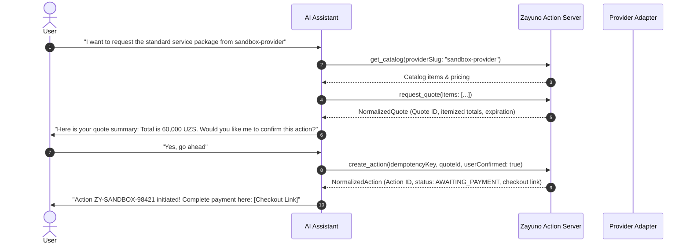

# Provider Actions Workflow Skill

This skill defines the canonical interaction flow for AI agents interacting with the Zayuno Action Infrastructure.

## Core Rules & Guardrails

1. **Capability Discovery First**:
   - Always query `list_providers` or `get_provider_capabilities` before initiating domain actions to ensure the target provider supports the required capability (e.g. `CATALOG`, `QUOTE`, `ACTION_CREATE`).

2. **Mandatory Quote Requirement**:
   - NEVER call `create_action` directly without first calling `request_quote`.
   - The quote calculates exact unit prices, option add-on charges, fulfillment fees, and taxes.

3. **Explicit Affirmative Confirmation**:
   - Present the itemized quote to the user (Offerings, Quantities, Options, Subtotal, Fees, and Total).
   - Require explicit confirmation from the user (e.g. "Do you confirm this action for a total of 60,000 UZS?") before calling `create_action`.
   - Set `userConfirmed: true` in `create_action` arguments only after user consent.

4. **Idempotency Guarantee**:
   - Always generate and supply a unique `idempotencyKey` (UUIDv4 or random cryptographic string) when calling `create_action` to prevent duplicate transactions upon network retries.

5. **Payment URL Handling**:
   - Sensitive financial data (card numbers, CVV, OTPs) is NEVER requested or processed in conversational chat.
   - When payment is required, present the provider-supplied checkout URL returned by `get_payment_options` for secure HTTPS completion.

## Step-by-Step Execution Sequence

